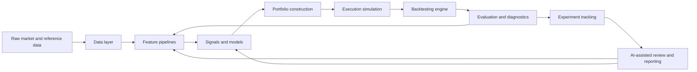

# Architecture

The platform is designed as a layered research system. Each layer owns one part of the research lifecycle and communicates through explicit interfaces rather than notebook-local assumptions.

## Conceptual Data Flow

## Module Responsibilities

### `data`

Owns data source abstractions, schemas, calendars, storage access, validation, and point-in-time dataset construction. This layer should make leakage difficult by design.

### `features`

Owns reusable feature definitions and feature pipelines. Feature code should be deterministic, versionable, and explicit about lookback windows, lagging, and timestamp alignment.

### `signals`

Converts features and model outputs into forecast-like signals. A signal should be inspectable independently of portfolio sizing.

### `models`

Owns model interfaces, training workflows, inference contracts, and validation split definitions. This layer should support both statistical models and machine learning models.

### `portfolio`

Transforms signals into target weights or positions under constraints such as max weight, exposure, turnover, volatility, and cash handling.

### `execution`

Models trade generation, fills, costs, slippage, and execution timing assumptions. Initial assumptions should suit daily or weekly ETF trading.

### `backtesting`

Coordinates historical simulation across data, signals, portfolio construction, and execution. It should orchestrate components rather than burying strategy logic.

### `evaluation`

Computes performance, risk, turnover, drawdown, exposure, attribution, and validation diagnostics.

### `experiments`

Defines the experiment lifecycle: configuration loading, run manifests, artifact paths, metadata, reproducibility, and tracking hooks.

### `agents`

Defines AI-agent contracts for research assistance, experiment analysis, report generation, and future automated diagnostics. Agents should consume structured artifacts rather than scraping notebooks.

### `utils`

Shared utilities that are genuinely cross-cutting, such as time handling, logging, identifiers, and filesystem helpers.

## Design Boundaries

- Notebook code is exploratory and should call reusable package code.
- Backtest orchestration should not own feature engineering or model logic.
- Portfolio construction should not know where features came from.
- Evaluation should operate on artifacts produced by backtests and experiments.
- AI agents should be optional workflow participants, not hidden dependencies of core research code.

