# Experiment Report: canonical_ml_multi_asset

- **Period:** 2013-01-01 to 2024-12-31
- **Universe:** SPY, QQQ, IWM, EEM, TLT, GLD, XLF, XLK, XLE
- **Sharpe ratio:** 0.5481

## Research Thesis & Methodology

**Hypothesis:** A shared RidgeRegression model predicts cross-sectional return ranks across the 9-asset universe using 13 engineered features applied independently to each asset. The top-ranked assets by predicted score, held equal-weight, earn a 21-day forward return edge over the universe after transaction costs.

**Feature rationale:**

- **`mom_20`** (window: 20): Trailing-return momentum captures the continuation of recent price trends — a well-documented persistent anomaly attributed to investor underreaction and gradual information diffusion.
- **`vol_21`** (window: 21): Rolling realised volatility characterises the current market regime: elevated volatility signals risk-off environments where expected returns and risk premia shift materially.
- **`zscore_20`** (window: 20): Rolling z-score normalisation transforms raw signals into a stationary, mean-zero representation, mitigating regime-level drift that would otherwise confound the model's cross-period comparisons.
- **`trend_20`** (window: 20): Trend strength (slope R²) quantifies how consistently directional a price series has been — distinguishing sustained trends from noisy mean-reverting behaviour.
- **`trend_persist_20d`** (window: 20): Trend persistence measures the fraction of trading days within the window on which the asset's daily return was positive — a directional hit rate. Unlike raw momentum (which measures magnitude) or trend strength (which measures linearity), this captures how *consistently* each day contributed to the trend direction, exposing the noise structure within the momentum window.
- **`breakout_63d`** (window: 63): Breakout strength measures the proximity of the current price to its rolling N-period high: (price / rolling_max) − 1. A value near zero indicates the asset is at or near its recent range top — the breakout regime. Large negative values indicate the asset is well below its recent high. The model can learn whether proximity to recent highs signals continuation (momentum) or resistance (mean-reversion), a relationship that reverses across macro regimes.
- **`drawdown_dist_252d`** (window: 252): Drawdown distance measures the current price's percentage decline from its rolling N-period peak: (price / rolling_max) − 1 over a long lookback window. Unlike short-horizon breakout strength, this captures sustained stress-state positioning — whether an asset remains in an extended drawdown relative to its annual price history. Assets with large negative values are in prolonged underperformance regimes; values near zero indicate the asset is near or recovering to its annual high-water mark.
- **`vol_compress_21_63`**: Volatility compression measures the ratio of short-term to long-term realised volatility. A ratio below 1.0 indicates a compressed-vol regime — recent realised vol has contracted relative to its medium-term baseline. This is a breakout precursor indicator: periods of sustained vol compression historically precede regime transitions. A ratio above 1.0 indicates vol expansion, consistent with an active stress or dislocation environment.
- **`beta_60d`** (window: 60): Rolling market beta measures each asset's time-varying sensitivity to the market reference (SPY): Cov(r_asset, r_market) / Var(r_market) over a rolling window. In a cross-sectional ranking framework, beta captures which assets are currently high-beta (amplified systematic exposure) vs defensive (low-beta) — information that is orthogonal to price-history momentum and directly relevant to regime positioning. A model learning positive beta coefficients is selecting high-beta assets in trending markets; negative coefficients indicate a preference for defensives.
- **`sharpe_mom_252d`**: Risk-adjusted momentum divides the trailing N-period return by rolling realised volatility — a Sharpe-like signal measuring momentum quality rather than raw magnitude. Two assets with equal 12-month momentum but different volatilities receive different scores: the lower-vol asset achieves its return more efficiently. This exposes whether the model rewards momentum consistency (efficient uptrends) or raw return regardless of the risk taken to achieve it.

**Label construction:** `ranking_target` with 21-period horizon. Cross-sectional return rank labels normalise each asset's forward return to a percentile position within the universe on each date. Ranking eliminates the effect of aggregate market moves, focusing the model on relative outperformance — a cleaner signal for cross-sectional selection.

**Model choice:** Ridge regression (L2 regularisation) is the natural baseline for financial ML: it is interpretable, computationally stable, and its regularisation controls overfitting in the high-noise, low signal-to-noise regime of asset returns without eliminating features entirely.

| Hyperparameter | Value |
| --- | --- |
| alpha | 0.5 |

**Signal translation:** The top-N signal selects the N assets with the highest predictions at each rebalance, enabling cross-sectional portfolio construction from multi-asset prediction outputs.

**Key risks and limitations:**

- *Low signal-to-noise ratio* — Asset return prediction is a notoriously difficult task. Even a statistically significant in-sample fit does not guarantee that the signal survives out-of-sample in a different market regime.
- *Regime non-stationarity* — Feature-return relationships that held during the training window may weaken or reverse in different macro environments. Walk-forward validation tests chronological robustness but cannot fully simulate live deployment.
- *Overfitting risk* — With a limited sample and multiple features, regularisation is essential. Coefficient stability across walk-forward splits is a key diagnostic for detecting overfitting.
- *Transaction costs* — ML signals can produce frequent position changes. Cost drag compounds at high turnover; the model's net alpha must comfortably exceed the cost of executing its predicted positions.

**Scope:** This investigation is a systematic demonstration of the full ML research process: feature engineering, leakage-safe alignment, regularised model training, walk-forward validation, and signal translation. *The methodology is the product.*

## Universe Construction & Coverage

The research universe comprises 9 institutional ETFs spanning US equities (SPY, QQQ, IWM), international equities (EEM), rates (TLT), commodities (GLD), and sectors (XLF, XLK, XLE). The panel covers 3,020 trading days (2013-01-02 to 2024-12-31), providing a structurally diverse cross-sectional environment for regime-heterogeneous research.

**Asset coverage summary:**

| Asset | Trading Days | First Date | Last Date | Missingness | Mean Ann. Vol |
| --- | --- | --- | --- | --- | --- |
| SPY | 3020 | 2013-01-02 | 2024-12-31 | 0.0% | 14.8% |
| QQQ | 3020 | 2013-01-02 | 2024-12-31 | 0.0% | 18.7% |
| IWM | 3020 | 2013-01-02 | 2024-12-31 | 0.0% | 19.7% |
| EEM | 3020 | 2013-01-02 | 2024-12-31 | 0.0% | 19.0% |
| TLT | 3020 | 2013-01-02 | 2024-12-31 | 0.0% | 14.0% |
| GLD | 3020 | 2013-01-02 | 2024-12-31 | 0.0% | 14.3% |
| XLF | 3020 | 2013-01-02 | 2024-12-31 | 0.0% | 18.6% |
| XLK | 3020 | 2013-01-02 | 2024-12-31 | 0.0% | 19.5% |
| XLE | 3020 | 2013-01-02 | 2024-12-31 | 0.0% | 24.6% |

**Cross-asset correlation structure:**

Mean pairwise correlation 0.40. Highest: QQQ/XLK (0.97) — structural co-movement. Lowest: TLT/XLF (-0.33) — regime diversification. Orthogonal asset pairs preserve cross-sectional signal breadth under correlated stress scenarios.

**Universe integrity:**

All 9 assets have complete coverage across all 3,020 trading days (2013-01-02 – 2024-12-31). Missingness: 0.0% for every asset. No structural gaps, delistings, or duplicate timestamps detected. Universe breadth is structurally stable throughout the backtest period.

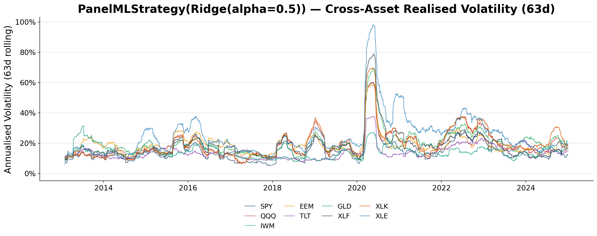

*63-day rolling annualised volatility by asset. Persistent divergence between risk-on and risk-off assets confirms macro regime heterogeneity. Synchronised spikes identify systemic stress episodes.*

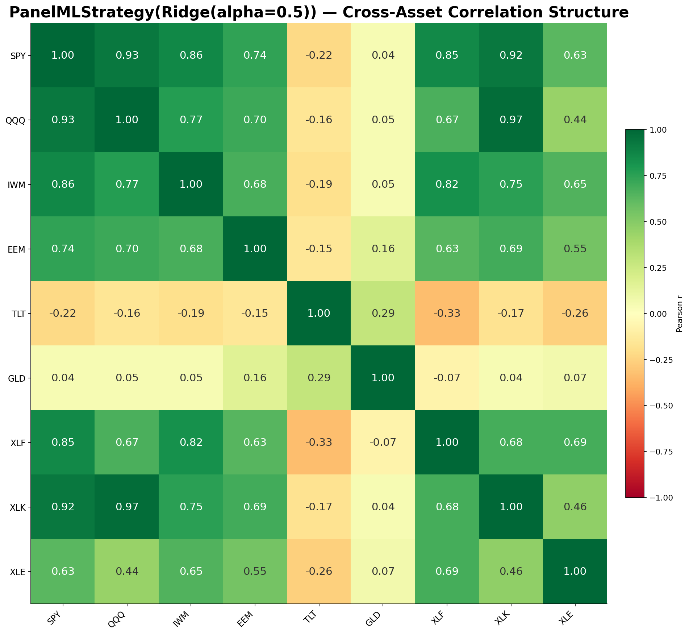

*Full-period pairwise return correlation matrix. Correlated clusters (e.g. SPY/QQQ/XLK) reduce effective breadth; low or negative correlations (e.g. TLT, GLD vs equities) confirm regime diversification.*

## Data Infrastructure

**Data source:** Yahoo Finance daily OHLCV data, ingested via `yfinance` and persisted to local Parquet files for reproducibility. All prices are adjusted closing prices.

**Alignment policy:** Inner join across all universe constituents — only trading days on which every asset has a valid price are retained. This eliminates NaN-driven look-ahead in cross-sectional ranking.

**Missing value policy:** Forward-fill up to a configurable limit (default: 5 trading days) for isolated gaps caused by exchange holidays or data vendor gaps. Gaps exceeding the limit remain NaN and are surfaced in diagnostics rather than silently filled. Over-cleaning (excessive interpolation) introduces bias by smoothing market structure.

**Coverage:** 3020 trading days from 2013-01-02 to 2024-12-31 across 9 assets.

| Asset | NaN Count | Ann. Return | Ann. Volatility |
| --- | --- | --- | --- |
| SPY | 0 | 13.0% | 16.8% |
| QQQ | 0 | 19.1% | 20.6% |
| IWM | 0 | 10.1% | 21.5% |
| EEM | 0 | 1.4% | 20.2% |
| TLT | 0 | -1.5% | 14.8% |
| GLD | 0 | 4.4% | 15.0% |
| XLF | 0 | 12.7% | 21.0% |
| XLK | 0 | 19.5% | 21.8% |
| XLE | 0 | 5.3% | 28.1% |

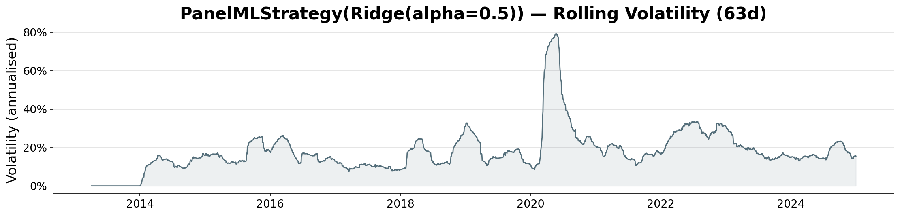

*63-day realised volatility. Elevated regimes and spikes contextualise coefficient instability, feature drift, and drawdown episodes below.*

## Feature Engineering

The 9-asset aligned price panel is transformed into a structured feature space. Each feature operationalises a specific hypothesis about the information content embedded in price time series — momentum persistence, volatility clustering, or trend strength. All features are constructed as pure functions of historical prices, ensuring no look-ahead contamination at the feature generation stage.

**Feature registry** — 13 features applied independently to each of the 9 universe assets:

| Name | Family | Transform | Window | Normalisation |
| --- | --- | --- | --- | --- |
| 20D Momentum | Trend | trailing_return | 20 | raw |
| 60D Momentum | Trend | trailing_return | 60 | raw |
| 252D Momentum | Trend | trailing_return | 252 | raw |
| 21D Realized Volatility | Volatility | rolling_std_annualised | 21 | raw |
| 20D Z-Score | Mean-Reversion | rolling_zscore | 20 | zscore |
| 20D Trend Strength | Trend | slope_r2 | 20 | raw |
| 5D Momentum | Trend | trailing_return | 5 | raw |
| 20D Trend Persistence | Trend | rolling_pos_day_fraction | 20 | raw |
| 63D Breakout Strength | Trend | price_vs_rolling_high | 63 | raw |
| 252D Drawdown Distance | Mean-Reversion | price_vs_rolling_peak | 252 | raw |
| Vol Compression (21/63D) | Volatility | short_long_vol_ratio | — | raw |
| 60D Market Beta | Market Structure | rolling_cov_over_var | 60 | raw |
| 252D Risk-Adj Momentum | Trend | momentum_over_vol | — | raw |

*Rolling z-score features are normalised in-place: mean and standard deviation are estimated over a rolling window centred at time t−1. This ensures normalisation parameters are derived from past data only, preserving the leakage-free property.*

**Label construction:**

| Parameter | Value |
| --- | --- |
| Label type | `ranking_target` |
| Horizon | 21 trading days |

**Sample construction and alignment:**

| Stage | Count / Value |
| --- | --- |
| Raw price observations (per asset) | 3020 |
| Warm-up rows removed (feature NaN) | 252 |
| Label rows removed (forward horizon NaN) | 21 |
| Aligned trading days per asset | 2747 |
| Pre-alignment pooled panel size (estimated) | 24,723  (2747 days × 9 assets) |
| Total alignment loss | 9.0% |
| Effective sample range | 2014-01-02 to 2024-11-29 |

*Warm-up and label rows are counted per asset. The pooled model trains on all (date, asset) pairs simultaneously — one shared Ridge model fitted on all pooled observations. Alignment loss is computed as the fraction of per-asset trading days removed;* *the pooled sample size is proportionally larger.*

**Per-feature statistics (pooled across all universe assets):**

| Feature | Mean | Std | Skew | AR(1) | Coverage |
| --- | --- | --- | --- | --- | --- |
| 20D Momentum | 0.0074 | 0.0533 | -0.70 | 0.942 | 100.0% |
| 60D Momentum | 0.0220 | 0.0880 | -0.21 | 0.977 | 100.0% |
| 252D Momentum | 0.0929 | 0.1997 | 0.45 | 0.994 | 100.0% |
| 21D Realized Volatility | 0.1768 | 0.1030 | 4.00 | 0.993 | 100.0% |
| 20D Z-Score | 0.2095 | 1.2929 | -0.34 | 0.869 | 100.0% |
| 20D Trend Strength | 0.1381 | 0.6544 | -0.28 | 0.984 | 100.0% |
| 5D Momentum | 0.0018 | 0.0273 | -0.56 | 0.787 | 100.0% |
| 20D Trend Persistence | 0.5323 | 0.1088 | 0.01 | 0.948 | 100.0% |
| 63D Breakout Strength | -0.0464 | 0.0539 | -2.40 | 0.978 | 100.0% |
| 252D Drawdown Distance | -0.0812 | 0.0854 | -1.59 | 0.992 | 100.0% |
| Vol Compression (21/63D) | 0.9789 | 0.2202 | 0.22 | 0.971 | 100.0% |
| 60D Market Beta | 0.8147 | 0.5613 | -1.08 | 0.999 | 100.0% |
| 252D Risk-Adj Momentum | 0.6711 | 1.1610 | 0.50 | 0.994 | 100.0% |

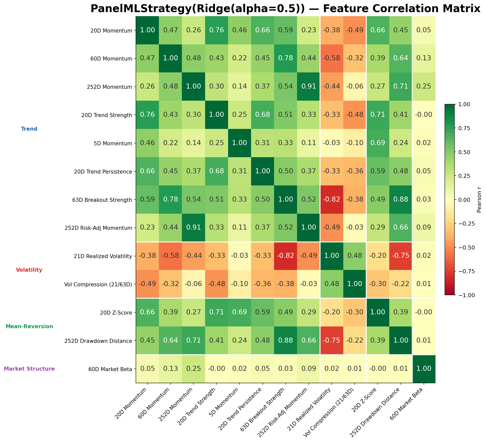

*Pairwise feature correlations. Correlated clusters reduce effective dimensionality; Ridge regularisation partially mitigates collinearity but reduces coefficient interpretability.*

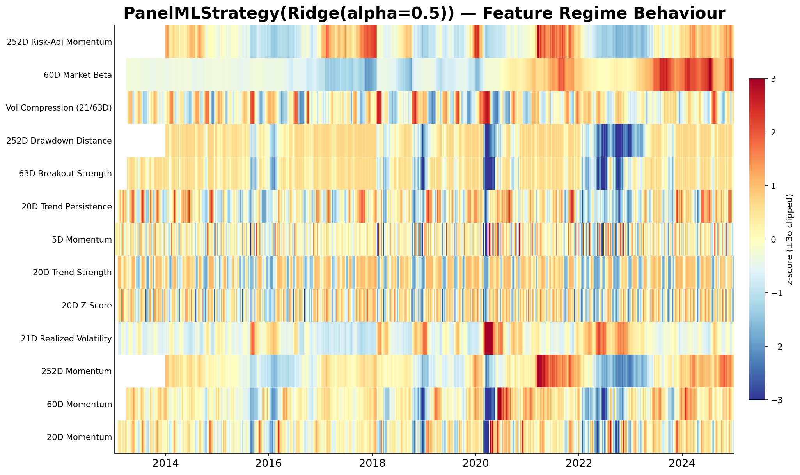

*Feature z-scores through time (±3σ). Red bands mark extreme positive regimes; blue marks extreme negative. Reveals when features were informative and where the environment shifted across the backtest period.*

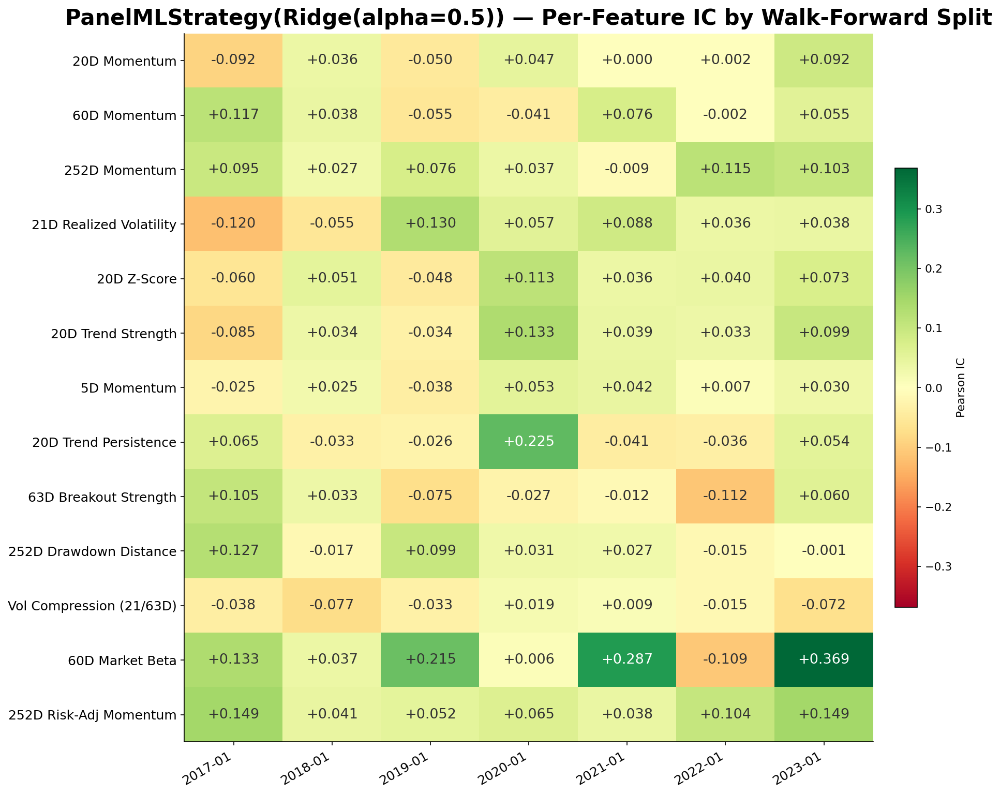

*Cross-sectional IC per feature per walk-forward split. Green cells mark splits where the feature improved cross-sectional ranking; red marks breakdown. Reveals whether each feature's cross-sectional information is consistent across regimes or regime-specific.*

**Feature family grouping:**

| Family | Features | Hypothesis |
| --- | --- | --- |
| Trend | 20D Momentum, 60D Momentum, 252D Momentum, 20D Trend Strength, 5D Momentum, 20D Trend Persistence, 63D Breakout Strength, 252D Risk-Adj Momentum | Directional momentum and price-continuation signals. Positive IC in trending regimes; may … |
| Volatility | 21D Realized Volatility, Vol Compression (21/63D) | Risk-regime indicators capturing realised and implied volatility structure. Tend to be neg… |
| Mean-Reversion | 20D Z-Score, 252D Drawdown Distance | Price normalisation and short-horizon reversion pressure. Effective when markets are range… |
| Market Structure | 60D Market Beta | Systematic risk exposure and cross-asset sensitivity dynamics. Rolling beta captures time-… |

This experiment deploys 13 features across 4 canonical families. Each family operationalises a distinct market hypothesis; orthogonal families provide diversified information sources, reducing model dependence on any single regime hypothesis.

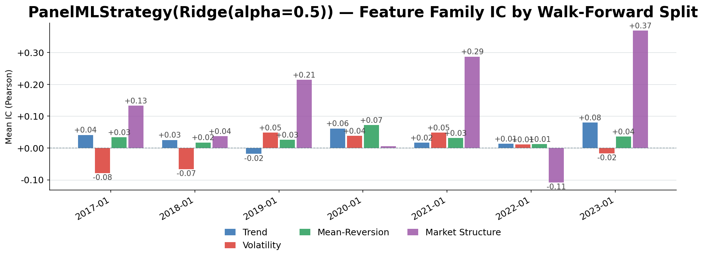

*Mean cross-sectional IC aggregated by feature family per walk-forward split. Positive bars confirm the family's features improved cross-sectional ranking in that regime; negative bars indicate systematic ranking reversal. Persistent dominance by a single family flags concentration in one market hypothesis.*

## Backtesting Methodology

All backtests use a strictly vectorized, look-ahead-safe execution framework. The critical invariant: no information from period *t* enters the position that earns the return of period *t*.

**Timing convention:**

| Step | Action | When |
| --- | --- | --- |
| Signal computed | Momentum scores calculated from all prices ≤ day *t* | Close of day *t* |
| Position entered | Computed weights applied to portfolio | Open of day *t+1* |
| Return realized | Portfolio return earned | Close of day *t+1* |

**Implementation:** `applied_weights = weights.shift(1)`. The strategy never observes the return it will receive when deciding to trade. The first row of every backtest has a zero position — the portfolio is flat until the first valid signal propagates through the one-day lag.

**Portfolio return computation per period:**

```
gross_return_t  = sum_i( weight_{i,t-1} * asset_return_{i,t} )
transaction_cost_t = sum_i( |weight_{i,t} - weight_{i,t-1}| ) * (5 / 10_000)
net_return_t    = gross_return_t - transaction_cost_t
equity_curve_t  = product_{s<=t}( 1 + net_return_s ),  anchored at 1.0
drawdown_t      = ( equity_t - max_{s<=t} equity_s ) / max_{s<=t} equity_s
```

**Transaction cost model:** One-way costs of 5 bps are applied to each unit of absolute portfolio weight change. Cost is incurred only on actual weight changes — during forward-fill periods between rebalances, weights are unchanged and no cost is deducted.

**Turnover definition:** Daily turnover = sum of absolute weight changes across all assets per period. High mean daily turnover implies high transaction cost drag; the cost model above makes this drag explicit.

## Portfolio Construction Process

**Signal-to-portfolio pipeline for `RidgeRegression` (panel cross-sectional):**

```
prices[t-window : t]
  → feature_matrix('mom_20', 'mom_60', 'mom_252', 'vol_21', ... (13 total))
       (X: 13 columns, no NaN rows, pre-alignment)
  → RidgeRegression.predict(X_clean)
       (raw score: expected ranking target)
  → signal_fn(predictions)   [top_n]
       weight_t = 1/top_n for top-N assets by prediction (cross-sectional)
  → forward_fill to daily index
  → shift(1)   [look-ahead prevention]
  → weights applied in portfolio backtest engine
```

**Leakage-prevention:** The `shift(1)` operation ensures that the weight active on trading day *t* was computed from information available only up to close of day *t−1*. The first valid signal enters the portfolio on the trading day following the first non-NaN prediction.

**Transaction cost model:** Costs are applied to every unit of absolute weight change per period. The model's net alpha must exceed the cost drag implied by its turnover to be viable in a live deployment.

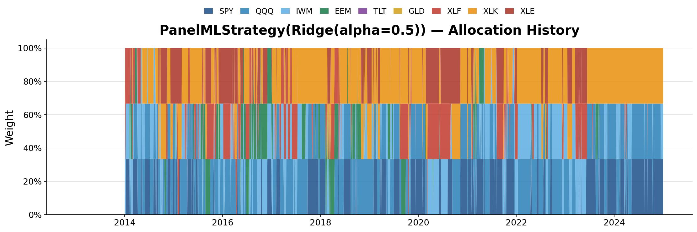

*Stacked allocation through time — which assets the model holds each period. Persistent concentration in one asset reveals ranking stability or regime lock-in. Rapid composition turnover (frequent colour transitions) coincides with regimes where cross-sectional scores are tightly clustered and small feature changes alter the ranking. Defensive migration (TLT/GLD dominance) marks risk-off transitions. Periods of equity breadth (multiple equity ETFs held) indicate low-dispersion regimes where the model distributes exposure broadly.*

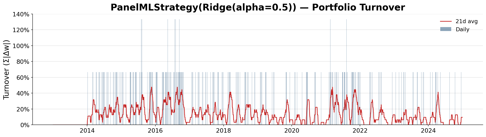

*Portfolio turnover quantifies daily weight change magnitude — the primary determinant of transaction cost drag. Periods of elevated turnover reduce net returns through friction. Turnover spikes that coincide with drawdown periods indicate cost-exacerbated losses: the signal is reversing precisely when it is most expensive to act on, amplifying rather than merely reducing performance.*

## ML Model Behaviour

**Predictive quality:**

| Metric | Value |
| --- | --- |
| Positive-IC ranking periods (full period) | 63.1% |
| Mean monthly cross-sectional IC | 0.1450 |
| % months with positive cross-sectional IC | 65.6% |
| Model-fitting observations (post-NaN removal) | 24,912 |

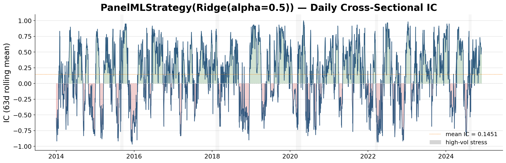

*Daily cross-sectional IC — mean 0.145 (66% of days positive), strong ranking signal. Persistent negative stretches mark regimes where the feature space inverted its cross-sectional prediction, not random noise.*

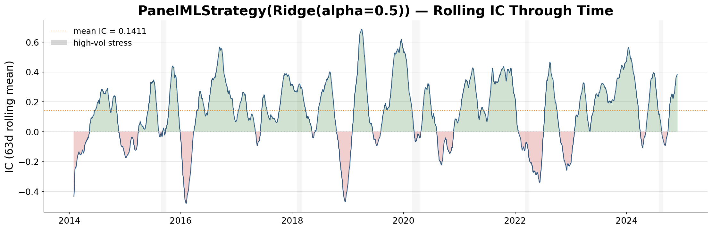

*63-day rolling mean cross-sectional IC — mean 0.145 (66% positive), strong ranking signal. Troughs identify regimes where cross-sectional feature relationships inverted or collapsed; recoveries confirm regime-specific rather than permanent model failure.*

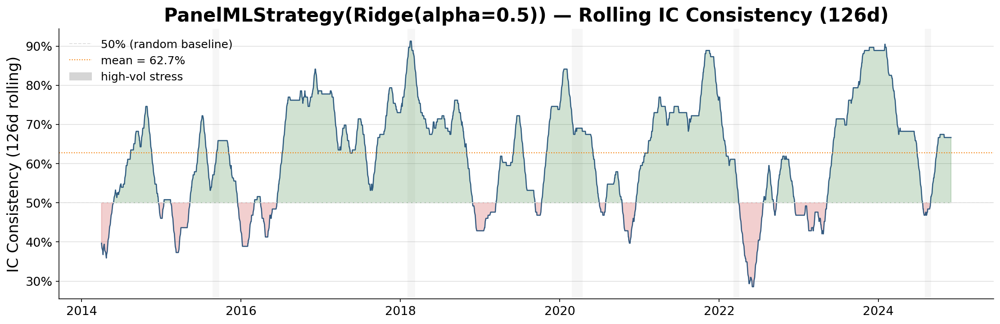

*126-day rolling IC consistency — full-period positive-IC rate 63.1%. Persistent troughs below 50% identify regimes where the cross-sectional ranking inverted: the model systematically mispredicted relative return order. Recovery above 50% confirms regime-specific rather than permanent breakdown.*


### Cross-Sectional Ranking Geometry

The following diagnostics expose the statistical geometry of the cross-sectional ranking system — measuring prediction dispersion, score discrimination, realized economic separation, and ranking stability. Together they reveal when the model had genuine cross-sectional conviction and when ranking became arbitrary.

| Metric | Value |
| --- | --- |
| Mean cross-sectional score IQR | 0.0346 |
| Min score IQR (most compressed regime) | 0.0120 |
| Mean top-bottom score spread | 0.0715 |
| Mean realized spread (top − bottom, pre-cost) | 0.891% (positive) |
| Fraction of periods with positive realized spread | 69% |
| Mean monthly rank autocorrelation | 0.785 |
| Fraction of months with positive rank persistence | 100% |

Score IQR remained above its minimum throughout (mean 0.0346, min 0.0120). The model maintained measurable cross-sectional separation across regimes.

Mean rank autocorrelation 0.79 — rankings were highly persistent. The model's ordering of assets was stable across consecutive rebalance periods, consistent with a momentum-driven hypothesis. 100% of monthly transitions had positive rank autocorrelation.

Realized top-bottom spread averaged 0.89% per period (69% of periods positive) — the model's score ranking corresponded to economic outcome separation over this horizon. This is a pre-cost gross spread; execution costs and market impact reduce the realisable advantage.

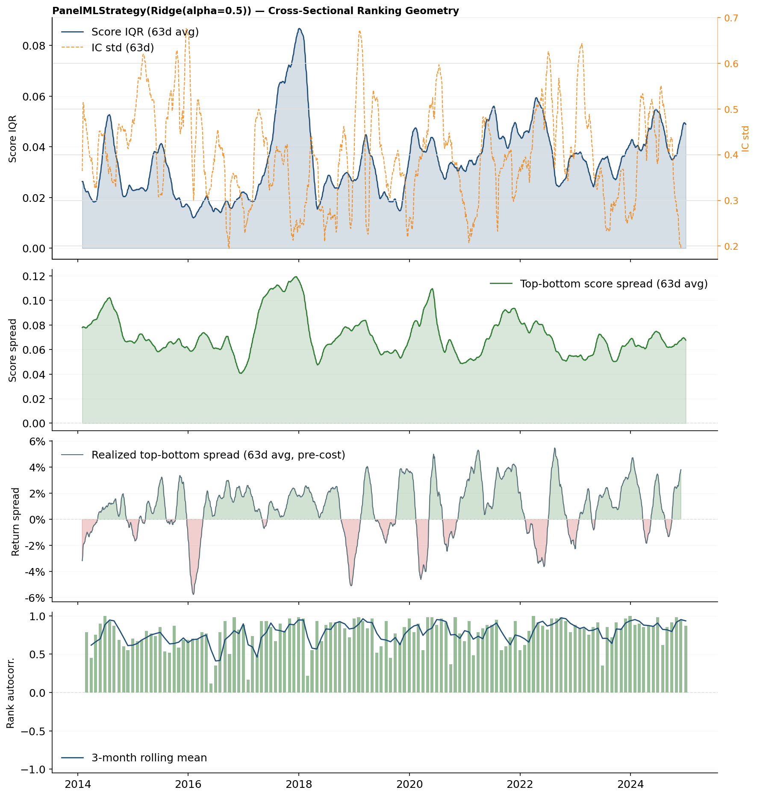

*Cross-sectional ranking geometry: prediction dispersion (score IQR) and IC instability (IC std, right axis); score discrimination (top-minus-bottom spread); realized return discrimination; and monthly rank autocorrelation. Periods of simultaneous IQR compression and elevated IC std identify regimes of compressed-but-erratic ranking — the most diagnostically significant failure state for a cross-sectional model.*


### Prediction Confidence & Outcome Monotonicity

Assets are ranked by predicted cross-sectional score on each monthly rebalance date and assigned to top, mid, or bottom thirds (~3 assets per group). Realized 21-day forward returns are evaluated per group across 131 monthly observations. Monotonic ordering — top group outperforming bottom — confirms that prediction magnitude, not merely sign, carries cross-sectional economic content.

| Prediction Group | Mean 21D Realized Return |
| --- | --- |
| Top group (highest scores) | 1.301% |
| Mid group | 1.050% |
| Bottom group (lowest scores) | 0.231% |
| Long-short spread (top − bottom) | 1.070% |

Realized return ordering is **monotonic** (top > mid > bottom). Score magnitude carries economically meaningful cross-sectional information: the model's ranking conviction corresponds to realized outcome strength.

The 21D long-short spread between top and bottom groups is 1.07% (positive). This is a pre-cost gross spread diagnostic, not a realisable strategy return. It quantifies the raw ranking discrimination of the signal before portfolio construction, transaction costs, and execution frictions.

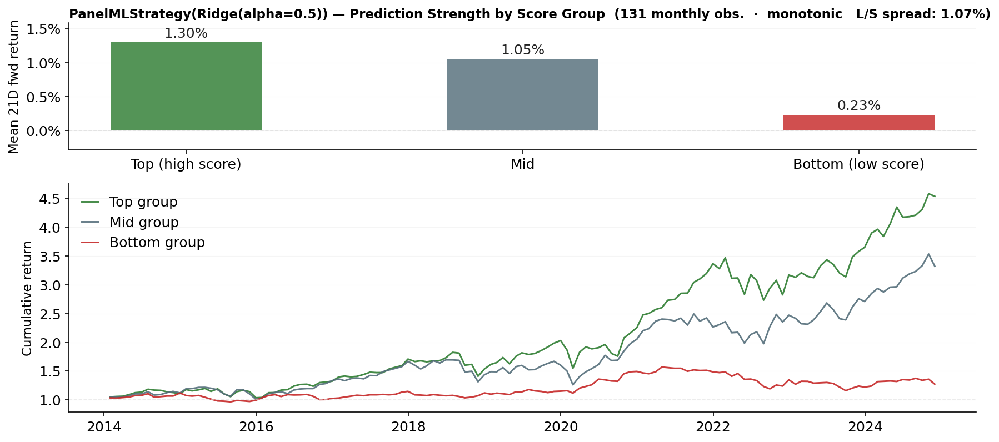

*Top panel: mean 21-day realized forward return by prediction score group (131 monthly observations, ~3 assets per group). Monotonic left-to-right ordering is the ML legitimacy diagnostic. Bottom panel: cumulative return of each prediction group over time. Persistent group separation confirms durable signal strength; convergence marks regimes of prediction-strength collapse.*


**Feature importance summary** (sorted by sign consistency):

| Feature | Full-period coef | Mean OOS coef | Sign consistency |
| --- | --- | --- | --- |
| 20D Trend Persistence | +0.0780 | +0.0948 | 100% |
| 60D Market Beta | +0.0519 | +0.0543 | 100% |
| 252D Risk-Adj Momentum | +0.0214 | +0.0436 | 100% |
| 252D Momentum | -0.0663 | -0.3660 | 86% |
| 252D Drawdown Distance | +0.0569 | +0.3327 | 86% |
| 20D Trend Strength | -0.0042 | -0.0159 | 71% |
| Vol Compression (21/63D) | -0.0350 | -0.0389 | 71% |
| 20D Momentum | -0.0893 | -0.0491 | 57% |
| 60D Momentum | -0.0846 | -0.1992 | 57% |
| 5D Momentum | +0.0567 | -0.0012 | 57% |
| 21D Realized Volatility | -0.0185 | +0.0023 | 43% |
| 20D Z-Score | +0.0002 | -0.0020 | 43% |
| 63D Breakout Strength | -0.1753 | -0.0097 | 43% |

*Full-period coef is from the model fitted on all data; mean OOS coef is the average across walk-forward splits. Divergence between the two indicates regime-specific learning — the full-period model captures structure the walk-forward splits did not consistently reproduce.*


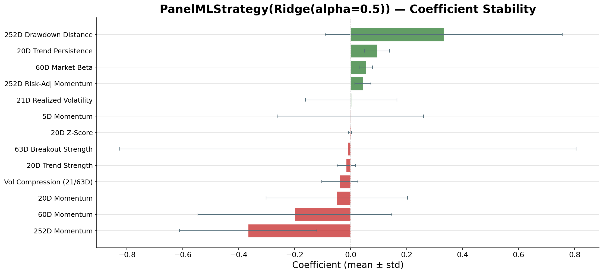

*20D Trend Persistence most stable (100% sign consistency); 21D Realized Volatility least stable (43%) — regime-dependent contribution. Wide error bars or sign reversals indicate training-regime-specific fitting.*

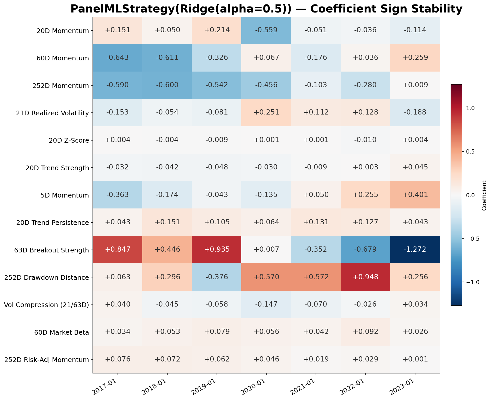

*`20D Momentum`, `60D Momentum`, `21D Realized Volatility` change sign across splits — regime-specific learning, not stable directional relationships. Stable features maintain colour throughout; reversals are the instability signature.*

### Temporal Feature Contribution

Feature contribution measures realised predictive influence: coefficient × standardised feature value at each date. Unlike static coefficient tables, contribution captures when each feature was activated, suppressed, or inverted — exposing how the model's internal predictive structure evolved through time.

| Diagnostic | Value |
| --- | --- |
| Dominant family (by contribution share) | Trend (96% of periods) |
| Family leadership transitions | 8 |
| Mean contribution concentration (HHI) | 0.437 — concentrated (one family dominates) |
| Most temporally volatile feature | 63D Breakout Strength |

The **Trend** family dominated predictions in 96% of periods, indicating the model's cross-sectional ranking signal was concentrated in a single predictive hypothesis for most of the backtest. This is characteristic of a momentum-regime environment where trend information dominates.

Contribution structure was stable and concentrated — 8 family leadership transitions across the backtest — consistent with a model that operated in persistent predictive regimes rather than frequently adapting.


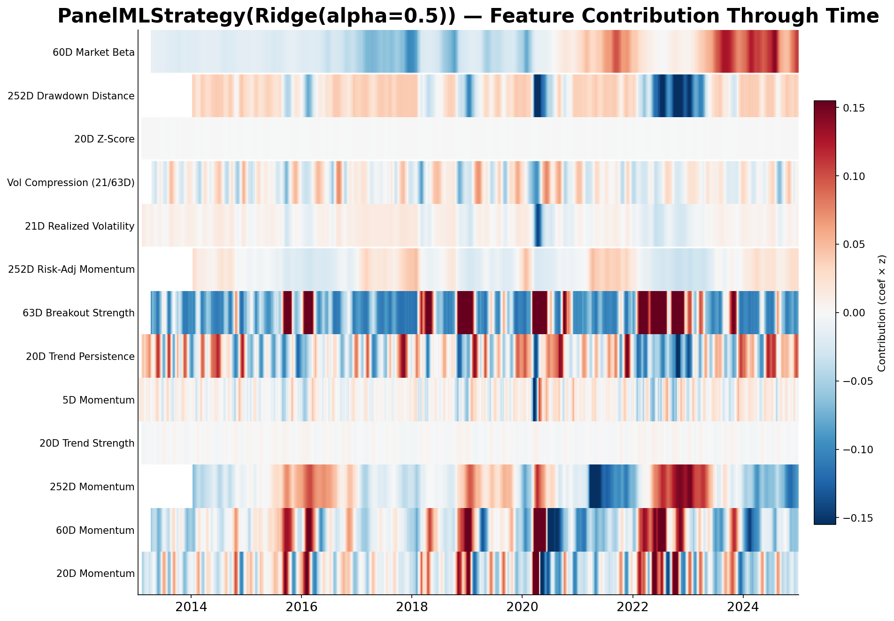

*Feature contribution heatmap: realised predictive influence (coefficient × standardised feature value) for each feature through time, grouped by family. Red = positive contribution (feature state predicts above-average cross-sectional return); blue = negative. Family separators mark hypothesis boundaries. Regime shifts appear as horizontal band colour transitions; simultaneous sign changes across a family reveal coordinated hypothesis activation or suppression. Contribution shown using panel reference-ticker feature values scaled by the shared panel coefficient vector.*

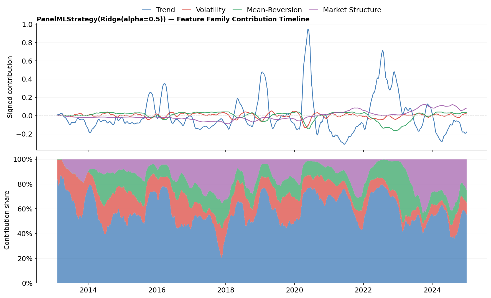

*Feature family contribution timeline. Top panel: signed rolling family contributions — shows which hypothesis family drove predictions and in which direction. Persistent positive contributions indicate an actively reinforcing family; negative contributions indicate the family is working against the dominant direction. Bottom panel: normalised absolute contribution share — shows family dominance through time regardless of sign. Regime shifts appear as share transitions between families.*

### Regime-Conditional Feature Behaviour

The 7 walk-forward test windows are classified into high-volatility (3 splits) and low-volatility (4 splits) regimes using median cross-asset 21D realised volatility as threshold. This classification exposes conditional cross-sectional IC behaviour — which feature families provided signal under stressed vs calm conditions.

| Feature Family | High-Vol Mean IC | Low-Vol Mean IC | Differential |
| --- | --- | --- | --- |
| Trend | +0.031 | +0.032 | -0.001 |
| Volatility | +0.033 | -0.029 | +0.061 |
| Mean-Reversion | +0.039 | +0.028 | +0.011 |
| Market Structure | +0.062 | +0.188 | -0.127 |

The **Market Structure** family provided the strongest cross-sectional IC in both volatility regimes, indicating a regime-persistent directional hypothesis. The IC differential across regimes reveals the degree of regime sensitivity within this dominant family.

**Volatility** reversed sign between regimes — positive cross-sectional IC in one environment became negative in the other. Sign reversals indicate regime-specific learning, not a stable directional relationship. **Market Structure** shows the largest regime sensitivity (differential -0.127), contributing stronger in low-vol splits.

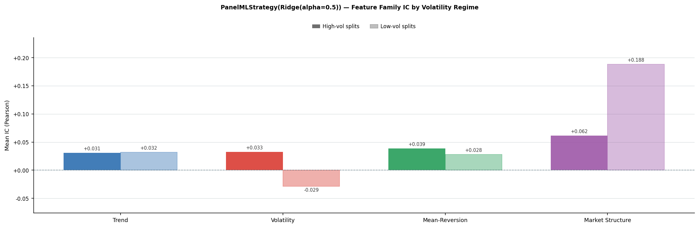

*Feature family mean IC disaggregated by vol regime. Solid bars = high-volatility test splits; faded = low-volatility. Regime threshold: median cross-asset 21D realised vol across 7 test windows. Sign reversals between solid and faded bars indicate regime-dependent hypothesis flips.*


## Performance Metrics

| Metric | Value |
| --- | --- |
| Annualized Return | 0.0976 |
| Annualized Volatility | 0.2106 |
| Sharpe Ratio | 0.5481 |
| Max Drawdown | -0.4500 |
| Calmar Ratio | 0.2168 |
| Hit Rate | 0.4967 |

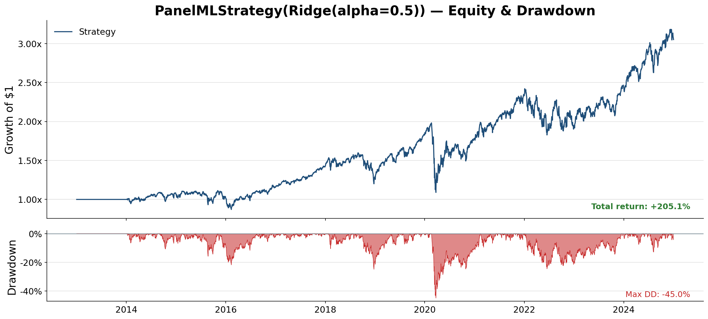

*Max drawdown -45.0% — severe. Sharpe 0.55. Slow recovery indicates signal-edge loss, not random noise.*

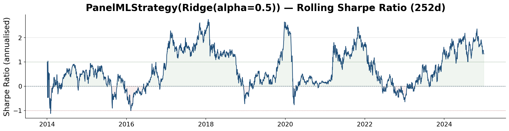

*Extended sub-zero periods mark sustained underperformance episodes. Rolling Sharpe variance is as diagnostically informative as its mean.*

## Walk-Forward Validation

Chronological rolling validation: each test window immediately follows its training window in calendar time, with no overlap. This is the only leakage-safe simulation of live deployment — the model is never tested on data from periods it could have seen during training.

**Validation type:** `rolling`

| Parameter | Value |
| --- | --- |
| step_months | 12 |
| test_months | 12 |
| train_months | 48 |

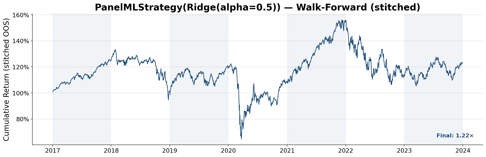

*Concatenated OOS test segments in chronological order. Consistent segment slopes across different market regimes confirm structural alpha. Persistent growth through stress periods is the strongest evidence of generalisation.*

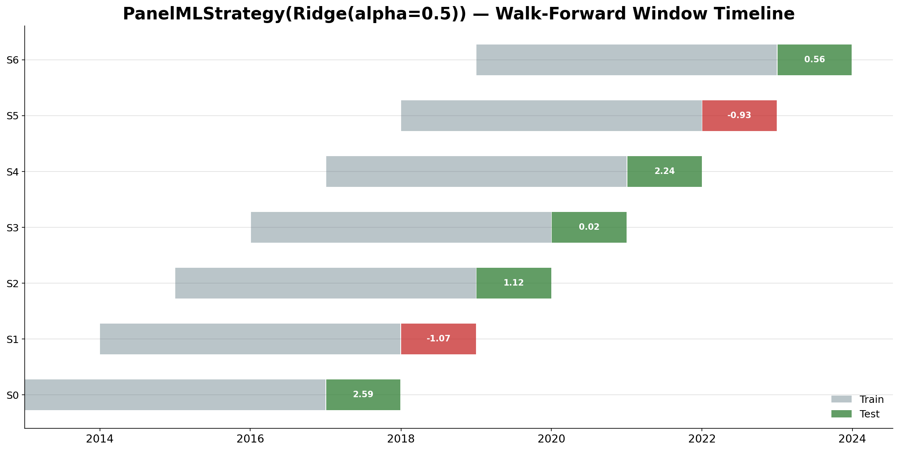

*Train/test windows in calendar time with OOS Sharpe annotated. Green test bars are positive-Sharpe splits; red are negative. Window widths reflect the configured train and test lengths.*

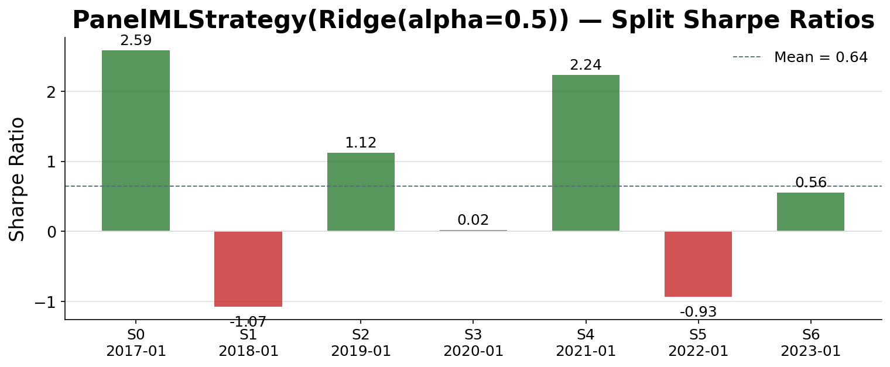

*Per-split OOS Sharpe distribution. High variance across splits indicates regime-dependent performance; a single outlier inflating the mean is a key failure mode.*

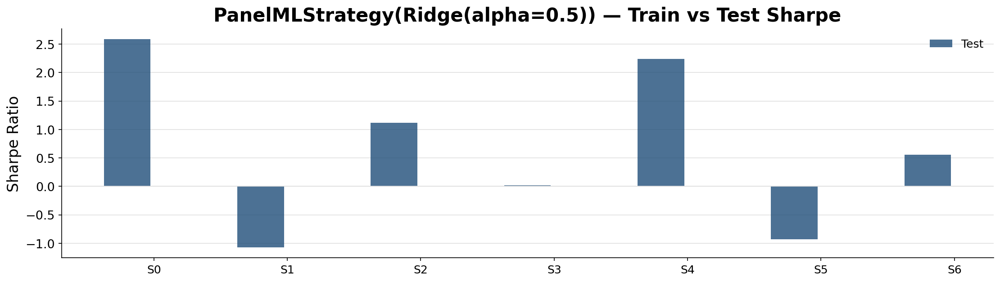

*Mean OOS Sharpe 0.64 across 7 splits (positive, 71% positive). Large per-split gaps mark regime-specific overfitting.*

## Failure Analysis

**Failure analysis — ML signal:**

*Out-of-sample verdict:* RidgeRegression demonstrates robust out-of-sample performance: 5 of 7 test windows were positive (mean OOS Sharpe: 0.64).

**Known failure modes for ML price-history strategies:**

- *Regime non-stationarity* — Feature-return relationships shift across macro regimes (risk-on/risk-off, trending/mean-reverting, high/low volatility). A model trained on 2013–2016 data learns relationships that may not hold in 2022 tightening cycles or 2020 dislocation episodes. Mean cross-sectional IC of 0.145 confirms ranking signal exists in aggregate, but sub-period IC variation (visible in the IC chart) reveals regime dependence.
- *Feature instability* — `mom_20`, `mom_60`, `vol_21`, `zscore_20` show sign consistency below 60% across walk-forward splits, indicating their directional contribution reverses in different training regimes. The model is learning regime-specific patterns, not persistent market relationships.
- *Overfitting on training regime* — Ridge regularisation constrains but does not eliminate overfitting risk. Large train-to-test Sharpe gaps in specific splits are the diagnostic signature of regime-specific learning.
- *Cross-sectional dispersion collapse* — In low-dispersion regimes where all assets trend together, the cross-sectional model has little return differentiation to exploit. The top-N signal concentrates in whichever assets have marginally higher scores, but all scores are clustered — the effective information content drops.
- *Transaction cost drag from universe rotation* — Holding the top-N assets requires full rebalancing when the composition changes. In regimes of high score volatility, turnover rises sharply and cost drag erodes signal value.

**Instability propagation:**

Coefficient sign reversals in 20D Momentum, 60D Momentum, 21D Realized Volatility indicate the model learned regime-specific rather than structural relationships. IC is consistently positive (66% of periods, mean 0.1450), propagating coefficient instability into signal degradation. Positive-IC rate (63.1%) is above random; instability in learned feature weights propagates into cross-sectional ranking errors that reach portfolio returns.

**Identified drawdown windows (> 5% peak-to-trough):**

| Drawdown Start | Trough | Recovery | Max DD | Duration |
| --- | --- | --- | --- | --- |
| 2020-02-24 | 2020-03-23 | 2021-02-03 | -45.0% | 345d |
| 2018-10-05 | 2018-12-24 | 2019-03-21 | -24.9% | 167d |
| 2022-04-05 | 2022-06-16 | 2023-07-18 | -24.5% | 469d |

**Worst out-of-sample split:**

- Split 1 — test period 2018-01-02 to 2018-12-31
- Sharpe: -1.07
- Return: -18.5%
- Max DD: -29.0%

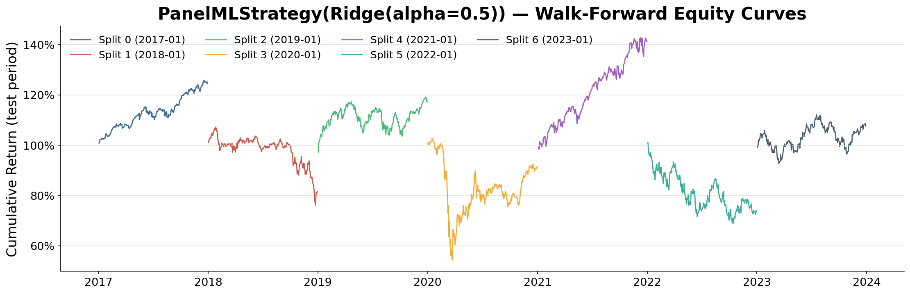

*Divergent split trajectories identify regimes where the signal broke down. Consistent slopes across periods indicate regime-independent alpha.*

## Diagnostics Appendix

Detailed diagnostics for walk-forward validation and ML signal quality.

### Walk-Forward Stability

| Metric | Value |
| --- | --- |
| Splits | 7 |
| Mean Sharpe | 0.6450 |
| Std Sharpe | 1.4365 |
| Positive-Sharpe rate | 71.4% |
| Mean annualised return | 5.40% |
| Mean max drawdown | -20.57% |
| Worst max drawdown | -47.13% |

### ML Signal Diagnostics

| Metric | Value |
| --- | --- |
| Avg daily turnover | 0.1266 |
| Signal activity | 91.6% |

## Metadata

| Field | Value |
| --- | --- |
| Experiment | `canonical_ml_multi_asset` |
| Strategy | `PanelMLStrategy(Ridge(alpha=0.5))` |
| Created | 2026-05-28T16:31:22.031214+00:00 |

## Configuration

**Universe:** SPY, QQQ, IWM, EEM, TLT, GLD, XLF, XLK, XLE

**Date range:** 2013-01-01 to 2024-12-31

**Strategy type:** `ML / RidgeRegression`

**Transaction cost:** 5.0 bps
**Validation:** `rolling`

## Figures

### Ml Information Coefficient

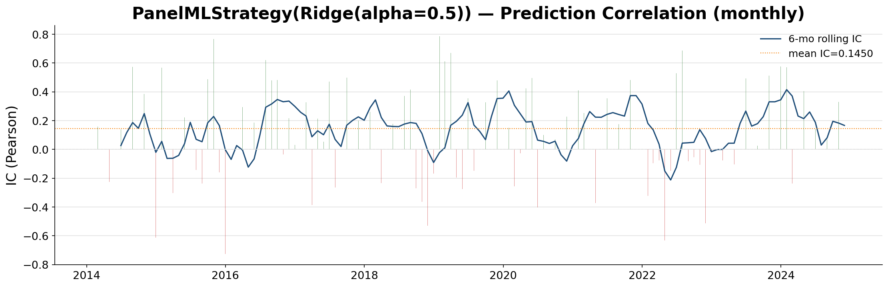

*Monthly rolling information coefficient (Pearson correlation of predicted vs actual returns). Persistent positive IC confirms the model adds directional information beyond chance.*

### Ml Prediction Distribution

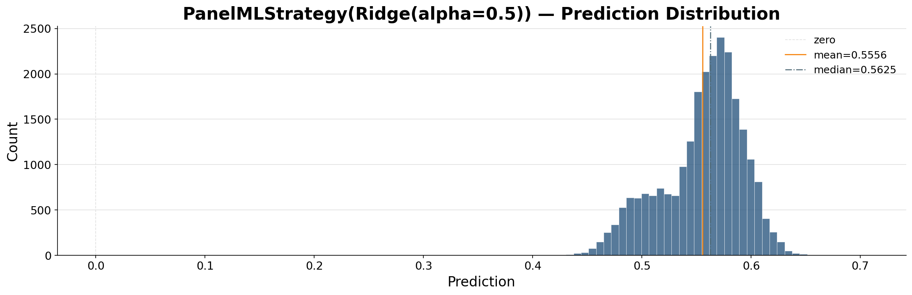

*Distribution of raw model predictions. Near-symmetric distributions centred near zero indicate a well-calibrated model without directional drift or label leakage.*

### Ml Coefficient Evolution

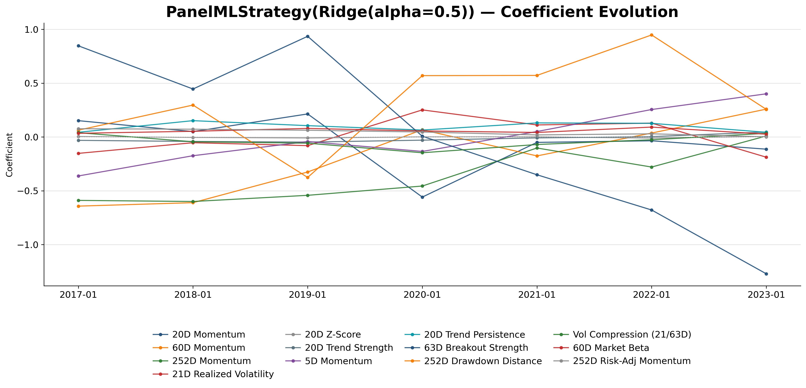

*Coefficient trajectory across walk-forward splits (chronological). Stable features maintain consistent sign and magnitude; unstable features cross zero, indicating regime-dependent learning.*

## Provenance

| Key | Value |
| --- | --- |
| ML hash | `57f80a44d026` |

---

Report version: 1
Generated: 2026-05-28T16:32:11.773897+00:00
Source experiment: canonical_ml_multi_asset