# Experiment Report: canonical_ml_showcase_v5

- **Period:** 2013-01-01 to 2024-12-31
- **Universe:** SPY
- **Sharpe ratio:** 0.6223

## Research Thesis & Methodology

**Hypothesis:** The feature space constructed from SPY price history contains statistically reliable information about 21-day forward returns. A RidgeRegression model trained on 6 engineered features can extract this signal and translate it into a risk-adjusted return edge after transaction costs.

**Feature rationale:**

- **`mom_20`** (window: 20): Trailing-return momentum captures the continuation of recent price trends — a well-documented persistent anomaly attributed to investor underreaction and gradual information diffusion.
- **`vol_21`** (window: 21): Rolling realised volatility characterises the current market regime: elevated volatility signals risk-off environments where expected returns and risk premia shift materially.
- **`zscore_20`** (window: 20): Rolling z-score normalisation transforms raw signals into a stationary, mean-zero representation, mitigating regime-level drift that would otherwise confound the model's cross-period comparisons.
- **`trend_20`** (window: 20): Trend strength (slope R²) quantifies how consistently directional a price series has been — distinguishing sustained trends from noisy mean-reverting behaviour.

**Label construction:** `forward_returns` with 21-period horizon. Forward log returns are the direct target of the predictive task: the model learns to rank periods by expected price appreciation.

**Model choice:** Ridge regression (L2 regularisation) is the natural baseline for financial ML: it is interpretable, computationally stable, and its regularisation controls overfitting in the high-noise, low signal-to-noise regime of asset returns without eliminating features entirely.

| Hyperparameter | Value |
| --- | --- |
| alpha | 1.0 |

**Signal translation:** The sign signal translates continuous predictions into a binary long/flat position: positive prediction → long, non-positive → flat. This is the simplest leakage-free translation of regression output into a tradeable signal.

**Key risks and limitations:**

- *Low signal-to-noise ratio* — Asset return prediction is a notoriously difficult task. Even a statistically significant in-sample fit does not guarantee that the signal survives out-of-sample in a different market regime.
- *Regime non-stationarity* — Feature-return relationships that held during the training window may weaken or reverse in different macro environments. Walk-forward validation tests chronological robustness but cannot fully simulate live deployment.
- *Overfitting risk* — With a limited sample and multiple features, regularisation is essential. Coefficient stability across walk-forward splits is a key diagnostic for detecting overfitting.
- *Transaction costs* — ML signals can produce frequent position changes. Cost drag compounds at high turnover; the model's net alpha must comfortably exceed the cost of executing its predicted positions.

**Scope:** This investigation is a systematic demonstration of the full ML research process: feature engineering, leakage-safe alignment, regularised model training, walk-forward validation, and signal translation. *The methodology is the product.*

## Universe Construction & Coverage

The research universe comprises 1 institutional ETF spanning US equities (SPY). The panel covers 3,020 trading days (2013-01-02 to 2024-12-31), providing a structurally diverse cross-sectional environment for regime-heterogeneous research.

**Asset coverage summary:**

| Asset | Trading Days | First Date | Last Date | Missingness | Mean Ann. Vol |
| --- | --- | --- | --- | --- | --- |
| SPY | 3020 | 2013-01-02 | 2024-12-31 | 0.0% | 14.8% |

**Universe integrity:**

All 1 assets have complete coverage across all 3,020 trading days (2013-01-02 – 2024-12-31). Missingness: 0.0% for every asset. No structural gaps, delistings, or duplicate timestamps detected. Universe breadth is structurally stable throughout the backtest period.

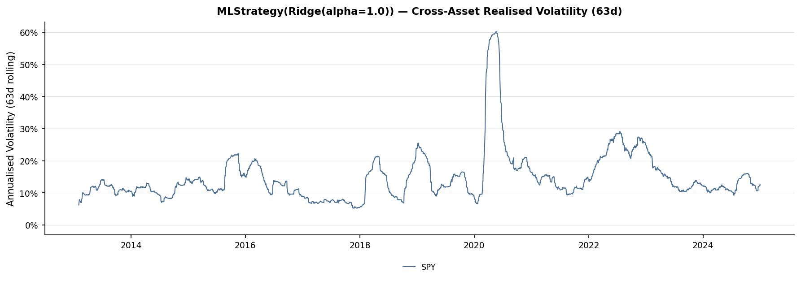

*63-day rolling annualised volatility by asset. Persistent divergence between risk-on and risk-off assets confirms macro regime heterogeneity. Synchronised spikes identify systemic stress episodes.*

## Data Infrastructure

**Data source:** Yahoo Finance daily OHLCV data, ingested via `yfinance` and persisted to local Parquet files for reproducibility. All prices are adjusted closing prices.

**Alignment policy:** Inner join across all universe constituents — only trading days on which every asset has a valid price are retained. This ensures a consistent observation timeline for feature construction.

**Missing value policy:** Forward-fill up to a configurable limit (default: 5 trading days) for isolated gaps caused by exchange holidays or data vendor gaps. Gaps exceeding the limit remain NaN and are surfaced in diagnostics rather than silently filled. Over-cleaning (excessive interpolation) introduces bias by smoothing market structure.

**Coverage:** 3020 trading days from 2013-01-02 to 2024-12-31 across 1 assets.

| Asset | NaN Count | Ann. Return | Ann. Volatility |
| --- | --- | --- | --- |
| SPY | 0 | 13.0% | 16.8% |

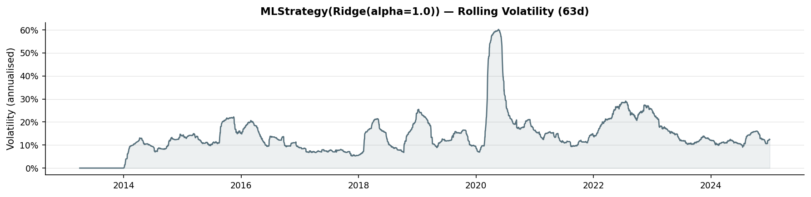

*63-day realised volatility. Elevated regimes and spikes contextualise coefficient instability, feature drift, and drawdown episodes below.*

## Feature Engineering

The `SPY` price history is transformed into a structured feature space. Each feature operationalises a specific hypothesis about the information content embedded in price time series — momentum persistence, volatility clustering, or trend strength. All features are constructed as pure functions of historical prices, ensuring no look-ahead contamination at the feature generation stage.

**Feature registry** — 6 features constructed on `SPY`:

| Name | Family | Transform | Window | Normalisation |
| --- | --- | --- | --- | --- |
| 20D Momentum | Trend | trailing_return | 20 | raw |
| 252D Momentum | Trend | trailing_return | 252 | raw |
| 21D Realized Volatility | Volatility | rolling_std_annualised | 21 | raw |
| 20D Z-Score | Mean-Reversion | rolling_zscore | 20 | zscore |
| 20D Trend Strength | Trend | slope_r2 | 20 | raw |
| 5D Momentum | Trend | trailing_return | 5 | raw |

*Rolling z-score features are normalised in-place: mean and standard deviation are estimated over a rolling window centred at time t−1. This ensures normalisation parameters are derived from past data only, preserving the leakage-free property.*

**Label construction:**

| Parameter | Value |
| --- | --- |
| Label type | `forward_returns` |
| Horizon | 21 trading days |

**Sample construction and alignment:**

| Stage | Count / Value |
| --- | --- |
| Raw price observations (per asset) | 3020 |
| Warm-up rows removed (feature NaN) | 252 |
| Label rows removed (forward horizon NaN) | 21 |
| Final aligned training samples | 2747 |
| Total alignment loss | 9.0% |
| Effective sample range | 2014-01-02 to 2024-11-29 |

*Warm-up rows are removed when rolling feature windows require a minimum history (e.g., a 252-day momentum feature has no valid value for the first 252 observations). Label rows are removed because the forward return horizon creates NaN labels on the final N trading days of the sample.*

**Per-feature statistics (full-history, pre-alignment):**

| Feature | Mean | Std | Skew | AR(1) | Coverage |
| --- | --- | --- | --- | --- | --- |
| 20D Momentum | 0.0103 | 0.0416 | -1.30 | 0.936 | 99.3% |
| 252D Momentum | 0.1224 | 0.1328 | 0.20 | 0.991 | 91.7% |
| 21D Realized Volatility | 0.1420 | 0.0915 | 4.07 | 0.993 | 99.3% |
| 20D Z-Score | 0.4176 | 1.2603 | -0.73 | 0.859 | 99.4% |
| 20D Trend Strength | 0.2753 | 0.6307 | -0.61 | 0.984 | 99.4% |
| 5D Momentum | 0.0026 | 0.0219 | -0.85 | 0.778 | 99.8% |

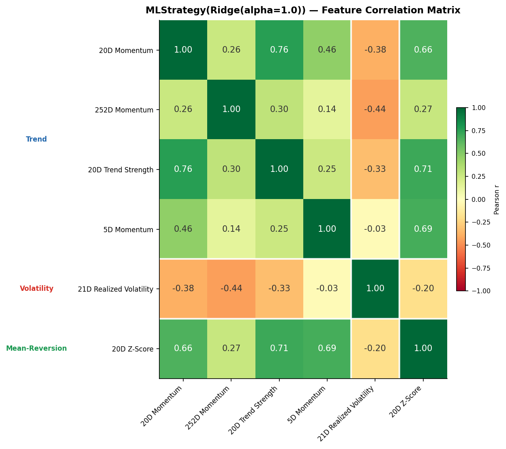

*Pairwise feature correlations. Correlated clusters reduce effective dimensionality; Ridge regularisation partially mitigates collinearity but reduces coefficient interpretability.*

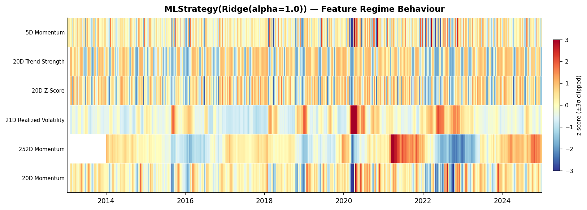

*Feature z-scores through time (±3σ). Red bands mark extreme positive regimes; blue marks extreme negative. Reveals when features were informative and where the environment shifted across the backtest period.*

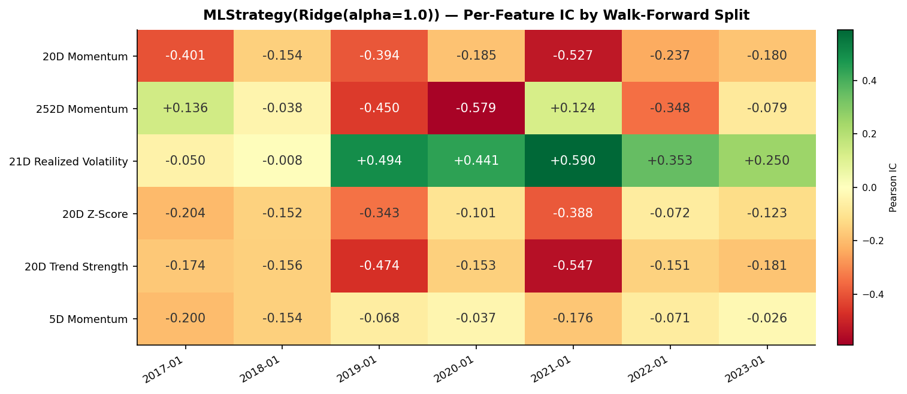

*Pearson IC per feature per walk-forward test split. Green cells mark positive predictive relationships; red marks breakdown. Reveals whether feature predictive power is consistent or regime-specific.*

**Feature family grouping:**

| Family | Features | Hypothesis |
| --- | --- | --- |
| Trend | 20D Momentum, 252D Momentum, 20D Trend Strength, 5D Momentum | Directional momentum and price-continuation signals. Positive IC in trending regimes; may … |
| Volatility | 21D Realized Volatility | Risk-regime indicators capturing realised and implied volatility structure. Tend to be neg… |
| Mean-Reversion | 20D Z-Score | Price normalisation and short-horizon reversion pressure. Effective when markets are range… |

This experiment deploys 6 features across 3 canonical families. Each family operationalises a distinct market hypothesis; orthogonal families provide diversified information sources, reducing model dependence on any single regime hypothesis.

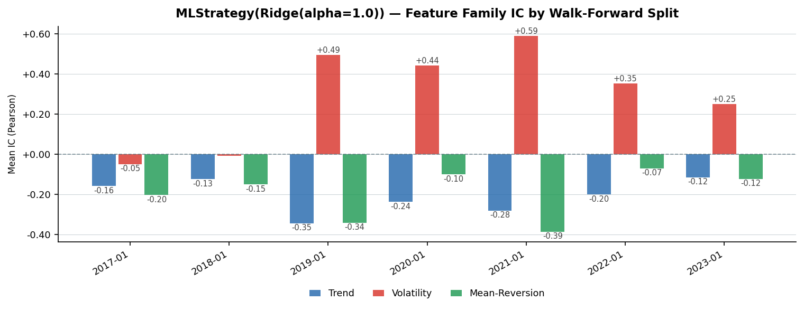

*Mean Pearson IC aggregated by feature family per walk-forward split. Positive bars confirm that the family hypothesis held in that regime; negative bars indicate systematic reversal. Persistent dominance by a single family flags model concentration risk.*

## Backtesting Methodology

All backtests use a strictly vectorized, look-ahead-safe execution framework. The critical invariant: no information from period *t* enters the position that earns the return of period *t*.

**Timing convention:**

| Step | Action | When |
| --- | --- | --- |
| Signal computed | Momentum scores calculated from all prices ≤ day *t* | Close of day *t* |
| Position entered | Computed weights applied to portfolio | Open of day *t+1* |
| Return realized | Portfolio return earned | Close of day *t+1* |

**Implementation:** `applied_weights = weights.shift(1)`. The strategy never observes the return it will receive when deciding to trade. The first row of every backtest has a zero position — the portfolio is flat until the first valid signal propagates through the one-day lag.

**Portfolio return computation per period:**

```
gross_return_t  = sum_i( weight_{i,t-1} * asset_return_{i,t} )
transaction_cost_t = sum_i( |weight_{i,t} - weight_{i,t-1}| ) * (5 / 10_000)
net_return_t    = gross_return_t - transaction_cost_t
equity_curve_t  = product_{s<=t}( 1 + net_return_s ),  anchored at 1.0
drawdown_t      = ( equity_t - max_{s<=t} equity_s ) / max_{s<=t} equity_s
```

**Transaction cost model:** One-way costs of 5 bps are applied to each unit of absolute portfolio weight change. Cost is incurred only on actual weight changes — during forward-fill periods between rebalances, weights are unchanged and no cost is deducted.

**Turnover definition:** Daily turnover = sum of absolute weight changes across all assets per period. High mean daily turnover implies high transaction cost drag; the cost model above makes this drag explicit.

## Portfolio Construction Process

**Signal-to-portfolio pipeline for `RidgeRegression` on `SPY`:**

```
prices[t-window : t]
  → feature_matrix('mom_20', 'mom_252', 'vol_21', 'zscore_20', ... (6 total))
       (X: 6 columns, no NaN rows, pre-alignment)
  → RidgeRegression.predict(X_clean)
       (raw score: expected forward returns)
  → signal_fn(predictions)   [sign]
       weight_t = 1 if predicted > 0 else 0   (long or flat)
  → forward_fill to daily index
  → shift(1)   [look-ahead prevention]
  → weights applied in portfolio backtest engine
```

**Leakage-prevention:** The `shift(1)` operation ensures that the weight active on trading day *t* was computed from information available only up to close of day *t−1*. The first valid signal enters the portfolio on the trading day following the first non-NaN prediction.

**Position sizing:** Equal-weight long-only. The model takes a full unit position when the prediction is positive and holds cash (zero weight) when the prediction is non-positive. There is no fractional position scaling — all conviction comes from the binary direction of the prediction.

**Transaction cost model:** Costs are applied to every unit of absolute weight change per period. The model's net alpha must exceed the cost drag implied by its turnover to be viable in a live deployment.

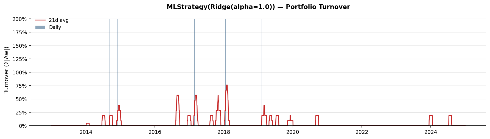

*Portfolio turnover quantifies daily weight change magnitude — the primary determinant of transaction cost drag. Periods of elevated turnover reduce net returns through friction. Turnover spikes that coincide with drawdown periods indicate cost-exacerbated losses: the signal is reversing precisely when it is most expensive to act on, amplifying rather than merely reducing performance.*

## ML Model Behaviour

**Predictive quality:**

| Metric | Value |
| --- | --- |
| Directional accuracy (full period) | 66.8% |
| Mean monthly IC (Pearson) | 0.5078 |
| % months with positive IC | 87.8% |
| Aligned training samples | 2,747 |

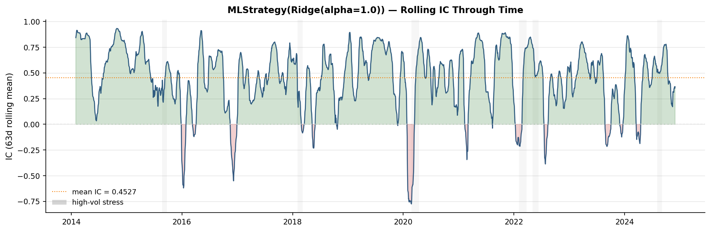

*Mean IC 0.508 (88% positive) — strong directional signal. Sub-period troughs mark regimes where the feature space lost predictive content.*

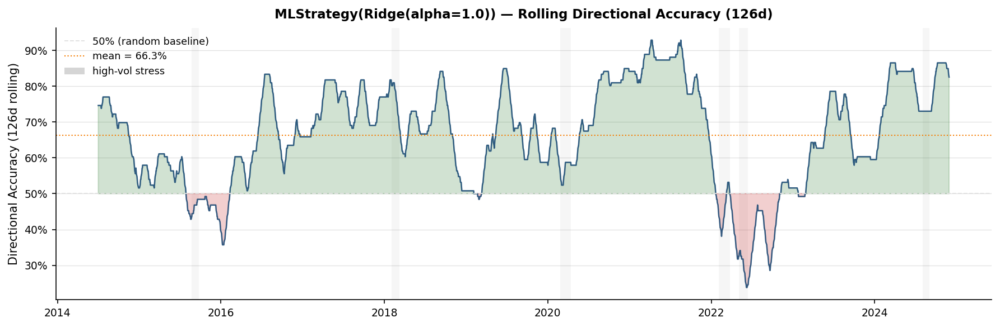

*Full-period directional accuracy 66.8%. Periods below 50% indicate the model generated net-incorrect directional calls — regime-linked degradation, not statistical noise.*


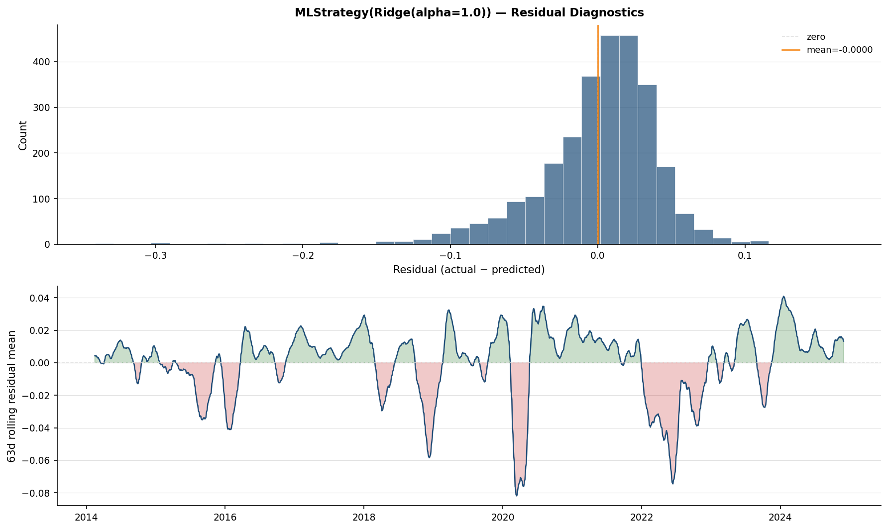

*Symmetric residuals near zero indicate an unbiased model. Skew or heavy tails signal calibration failure in extreme regimes. Rolling residual mean reveals temporal bias drift. 97% positive predictions — long-biased; errors skew toward missed downside. Directional accuracy: 66.8%.*

**Prediction confidence calibration:**

| Quintile | N | Mean pred | Mean actual | Dir. accuracy |
| --- | --- | --- | --- | --- |
| Q1 | 550 | +0.0013 | +0.0021 | 57.3% |
| Q2 | 549 | +0.0045 | +0.0096 | 67.4% |
| Q3 | 549 | +0.0081 | +0.0027 | 67.4% |
| Q4 | 549 | +0.0129 | +0.0140 | 72.1% |
| Q5 | 550 | +0.0240 | +0.0223 | 69.6% |

*Q5 accuracy (69.6%) exceeds Q1 (57.3%) — prediction magnitude carries information; higher-conviction signals are more accurate.*

**Feature importance summary** (sorted by sign consistency):

| Feature | Full-period coef | Mean OOS coef | Sign consistency |
| --- | --- | --- | --- |
| 252D Momentum | +0.0111 | -0.0445 | 71% |
| 21D Realized Volatility | +0.0852 | +0.0522 | 71% |
| 20D Z-Score | -0.0007 | -0.0007 | 71% |
| 20D Momentum | -0.0545 | -0.0140 | 57% |
| 20D Trend Strength | -0.0020 | -0.0026 | 57% |
| 5D Momentum | -0.0122 | -0.0054 | 57% |

*Full-period coef is from the model fitted on all data; mean OOS coef is the average across walk-forward splits. Divergence between the two indicates regime-specific learning — the full-period model captures structure the walk-forward splits did not consistently reproduce.*


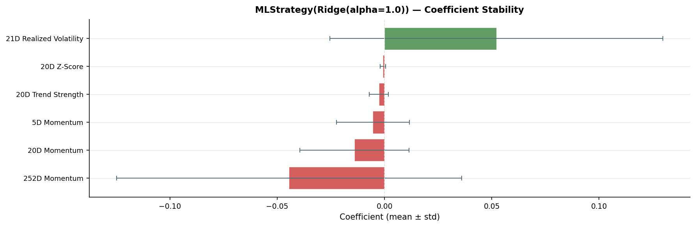

*252D Momentum most stable (71% sign consistency); 20D Momentum least stable (57%) — regime-dependent contribution. Wide error bars or sign reversals indicate training-regime-specific fitting.*

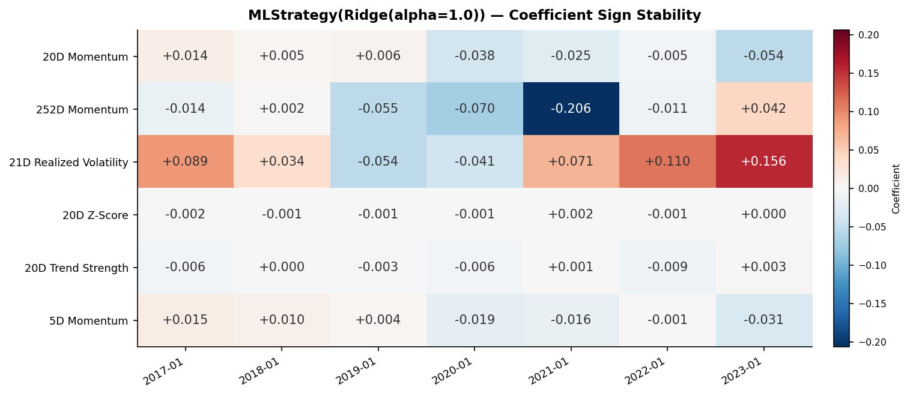

*`20D Momentum`, `20D Trend Strength`, `5D Momentum` change sign across splits — regime-specific learning, not stable directional relationships. Stable features maintain colour throughout; reversals are the instability signature.*

### Temporal Feature Contribution

Feature contribution measures realised predictive influence: coefficient × standardised feature value at each date. Unlike static coefficient tables, contribution captures when each feature was activated, suppressed, or inverted — exposing how the model's internal predictive structure evolved through time.

| Diagnostic | Value |
| --- | --- |
| Dominant family (by contribution share) | Volatility (62% of periods) |
| Family leadership transitions | 44 |
| Mean contribution concentration (HHI) | 0.528 — concentrated (one family dominates) |
| Most temporally volatile feature | 21D Realized Volatility |

The **Volatility** family dominated predictions in 62% of periods, indicating the model's directional prediction signal was concentrated in a single predictive hypothesis for most of the backtest. This is characteristic of a momentum-regime environment where trend information dominates.

Contribution structure was stable and concentrated — 44 family leadership transitions across the backtest — consistent with a model that operated in persistent predictive regimes rather than frequently adapting.


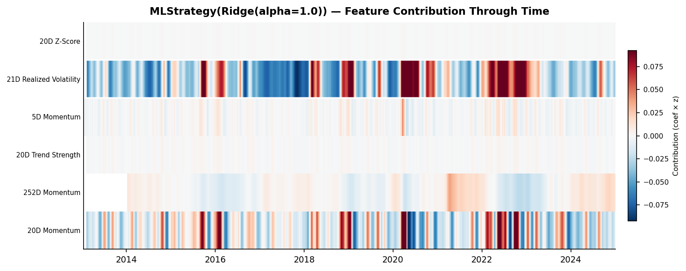

*Feature contribution heatmap: realised predictive influence (coefficient × standardised feature value) for each feature through time, grouped by family. Red = positive contribution (feature state predicts above-average cross-sectional return); blue = negative. Family separators mark hypothesis boundaries. Regime shifts appear as horizontal band colour transitions; simultaneous sign changes across a family reveal coordinated hypothesis activation or suppression.*

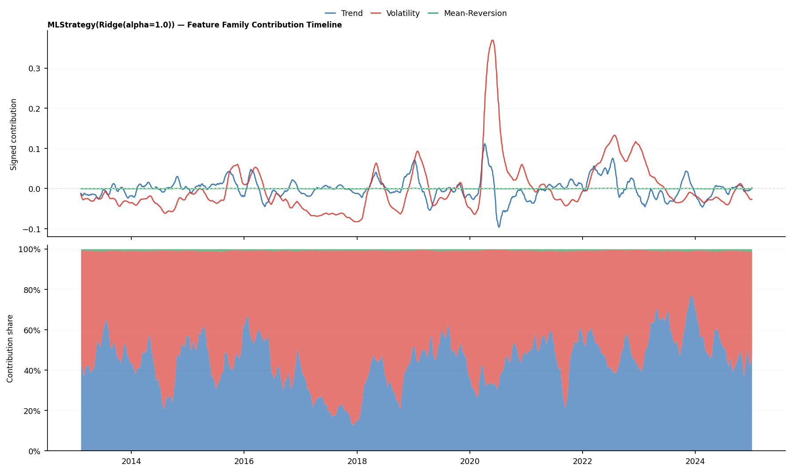

*Feature family contribution timeline. Top panel: signed rolling family contributions — shows which hypothesis family drove predictions and in which direction. Persistent positive contributions indicate an actively reinforcing family; negative contributions indicate the family is working against the dominant direction. Bottom panel: normalised absolute contribution share — shows family dominance through time regardless of sign. Regime shifts appear as share transitions between families.*

### Regime-Conditional Feature Behaviour

The 7 walk-forward test windows are classified into high-volatility (3 splits) and low-volatility (4 splits) regimes using median cross-asset 21D realised volatility as threshold. This classification exposes conditional IC behaviour — which feature families provided signal under stressed vs calm conditions.

| Feature Family | High-Vol Mean IC | Low-Vol Mean IC | Differential |
| --- | --- | --- | --- |
| Trend | -0.189 | -0.226 | +0.037 |
| Volatility | +0.262 | +0.321 | -0.059 |
| Mean-Reversion | -0.108 | -0.265 | +0.156 |

The **Volatility** family provided the strongest IC in both volatility regimes, indicating a regime-persistent directional hypothesis. The IC differential across regimes reveals the degree of regime sensitivity within this dominant family.

**Mean-Reversion** shows the largest regime sensitivity (differential +0.156), contributing stronger in high-vol splits.

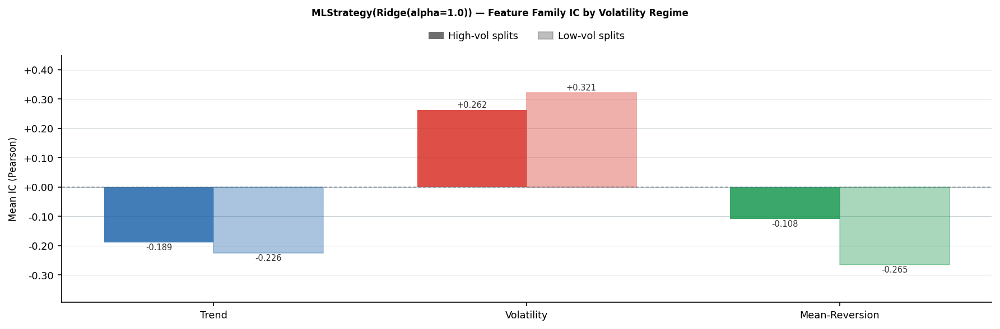

*Feature family mean IC disaggregated by vol regime. Solid bars = high-volatility test splits; faded = low-volatility. Regime threshold: median cross-asset 21D realised vol across 7 test windows. Sign reversals between solid and faded bars indicate regime-dependent hypothesis flips.*


## Performance Metrics

| Metric | Value |
| --- | --- |
| Annualized Return | 0.0929 |
| Annualized Volatility | 0.1647 |
| Sharpe Ratio | 0.6223 |
| Max Drawdown | -0.3410 |
| Calmar Ratio | 0.2725 |
| Hit Rate | 0.4990 |

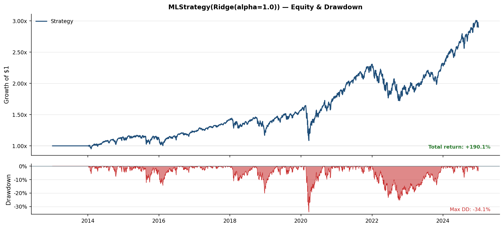

*Max drawdown -34.1% — severe. Sharpe 0.62. Slow recovery indicates signal-edge loss, not random noise.*

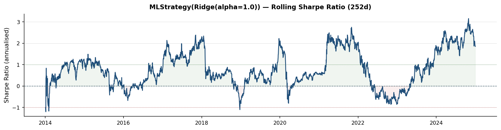

*Extended sub-zero periods mark sustained underperformance episodes. Rolling Sharpe variance is as diagnostically informative as its mean.*

## Walk-Forward Validation

Chronological rolling validation: each test window immediately follows its training window in calendar time, with no overlap. This is the only leakage-safe simulation of live deployment — the model is never tested on data from periods it could have seen during training.

**Validation type:** `rolling`

| Parameter | Value |
| --- | --- |
| step_months | 12 |
| test_months | 12 |
| train_months | 48 |

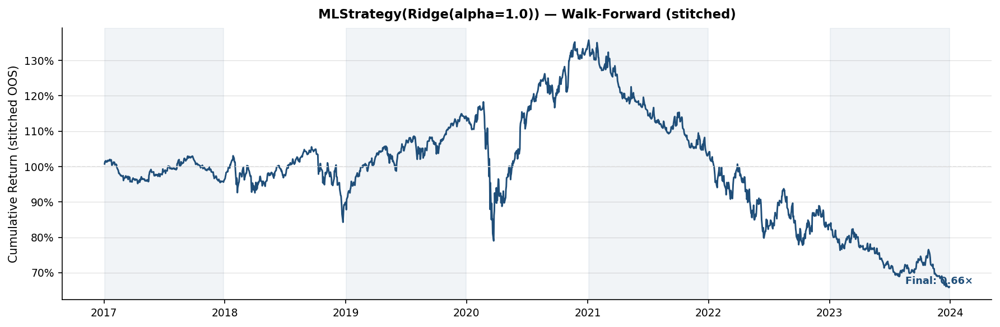

*Concatenated OOS test segments in chronological order. Consistent segment slopes across different market regimes confirm structural alpha. Persistent growth through stress periods is the strongest evidence of generalisation.*

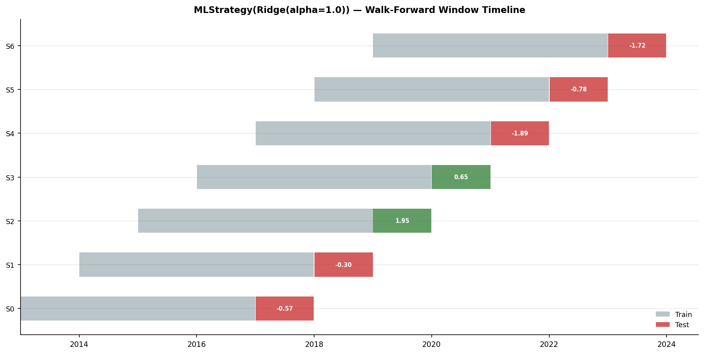

*Train/test windows in calendar time with OOS Sharpe annotated. Green test bars are positive-Sharpe splits; red are negative. Window widths reflect the configured train and test lengths.*

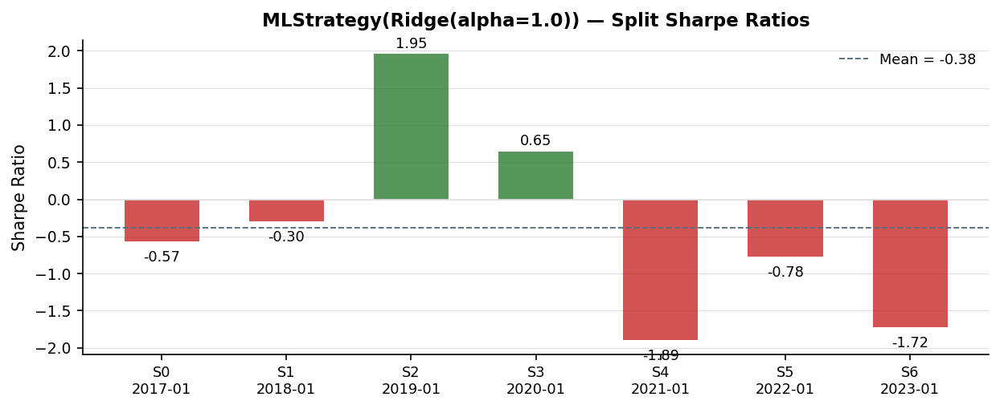

*Per-split OOS Sharpe distribution. High variance across splits indicates regime-dependent performance; a single outlier inflating the mean is a key failure mode.*

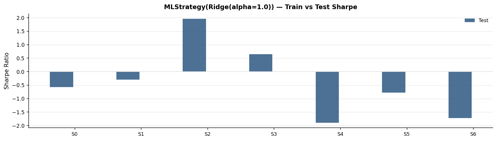

*Mean OOS Sharpe -0.38 across 7 splits (negative, 29% positive). Large per-split gaps mark regime-specific overfitting.*

## Failure Analysis

**Failure analysis — ML signal:**

*Out-of-sample verdict:* RidgeRegression failed to generalise out-of-sample: 5 of 7 test windows produced negative Sharpe (mean OOS Sharpe: -0.38). The in-sample signal does not survive chronological validation — the primary evidence of overfitting or regime specificity.

**Known failure modes for ML price-history strategies:**

- *Regime non-stationarity* — Feature-return relationships shift across macro regimes (risk-on/risk-off, trending/mean-reverting, high/low volatility). A model trained on 2013–2016 data learns relationships that may not hold in 2022 tightening cycles or 2020 dislocation episodes. Mean IC of 0.508 confirms directional signal exists in aggregate, but sub-period IC variation (visible in the IC chart) reveals regime dependence.
- *Feature instability* — `mom_20`, `trend_20`, `mom_5` show sign consistency below 60% across walk-forward splits, indicating their directional contribution reverses in different training regimes. The model is learning regime-specific patterns, not persistent market relationships.
- *Overfitting on training regime* — Ridge regularisation constrains but does not eliminate overfitting risk. Large train-to-test Sharpe gaps in specific splits are the diagnostic signature of regime-specific learning.
- *Binary signal coarseness* — The sign signal collapses continuous predictions to a binary long/flat position. Low-conviction predictions near zero generate positions identical in size to high-conviction signals, reducing the effective information ratio of the signal-to-position translation.
- *Transaction cost drag at high turnover* — The sign signal can produce frequent position reversals when predictions oscillate around zero. Each reversal incurs full round-trip cost. Cost drag is most acute in regimes where the signal has low directional persistence.

**Volatility-regime-conditioned performance:**

| Vol regime | N obs | Realized Sharpe | IC | Dir. accuracy |
| --- | --- | --- | --- | --- |
| Low | 909 | 9.86 | 0.1502 | 74.5% |
| Medium | 909 | 4.68 | 0.2671 | 66.8% |
| High | 909 | 1.65 | 0.3189 | 59.7% |

*Realized Sharpe deteriorates from low- to high-volatility regime (Δ8.21). IC follows the same pattern — regime-conditioned degradation, not random variation.*

**Instability propagation:**

Coefficient sign reversals in 20D Momentum, 20D Trend Strength, 5D Momentum indicate the model learned regime-specific rather than structural relationships. IC is consistently positive (88% of periods, mean 0.5078), propagating coefficient instability into signal degradation. Directional accuracy (66.8%) is above random; signal degradation from unstable features reaches realised trade outcomes. The Sharpe compression in high-volatility regimes confirms the propagation completes: feature instability → IC breakdown → ranking errors → losses.

**Identified drawdown windows (> 5% peak-to-trough):**

| Drawdown Start | Trough | Recovery | Max DD | Duration |
| --- | --- | --- | --- | --- |
| 2020-02-25 | 2020-03-23 | 2020-06-08 | -34.1% | 104d |
| 2022-04-05 | 2022-10-12 | 2023-07-18 | -25.4% | 469d |
| 2018-12-04 | 2018-12-24 | 2019-02-22 | -20.2% | 80d |

**Worst out-of-sample split:**

- Split 4 — test period 2021-01-04 to 2021-12-31
- Sharpe: -1.89
- Return: -22.6%
- Max DD: -24.1%

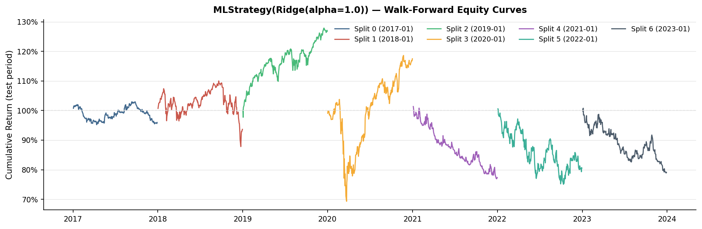

*Divergent split trajectories identify regimes where the signal broke down. Consistent slopes across periods indicate regime-independent alpha.*

## Diagnostics Appendix

Detailed diagnostics for walk-forward validation and ML signal quality.

### Walk-Forward Stability

| Metric | Value |
| --- | --- |
| Splits | 7 |
| Mean Sharpe | -0.3790 |
| Std Sharpe | 1.3409 |
| Positive-Sharpe rate | 28.6% |
| Mean annualised return | -4.20% |
| Mean max drawdown | -19.77% |
| Worst max drawdown | -33.21% |

### ML Signal Diagnostics

| Metric | Value |
| --- | --- |
| Avg daily turnover | 0.0361 |
| Signal activity | 91.6% |

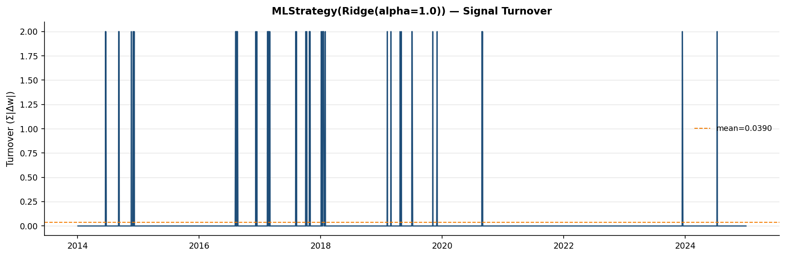

*Turnover spikes correlate with elevated cost drag. Coincidence with drawdown periods indicates cost structure amplifying losses.*

## Metadata

| Field | Value |
| --- | --- |
| Experiment | `canonical_ml_showcase_v5` |
| Strategy | `MLStrategy(Ridge(alpha=1.0))` |
| Created | 2026-06-06T14:02:34.462550+00:00 |

## Configuration

**Universe:** SPY

**Date range:** 2013-01-01 to 2024-12-31

**Strategy type:** `ML / RidgeRegression`

**Transaction cost:** 5.0 bps
**Validation:** `rolling`

## Figures

### Allocation History

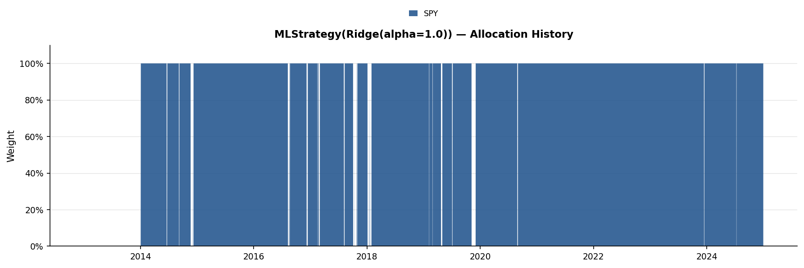

*Stacked allocation history — fractional weight per asset at each rebalance date. Concentration corresponds to momentum leaders in the cross-sectional ranking.*

### Ml Information Coefficient

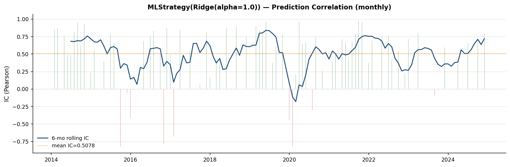

*Monthly rolling information coefficient (Pearson correlation of predicted vs actual returns). Persistent positive IC confirms the model adds directional information beyond chance.*

### Ml Prediction Vs Actual

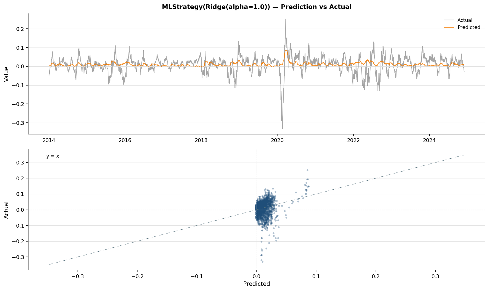

*Prediction vs actual overlay (top panel) and scatter (bottom panel). Appendix-level supplement to the rolling IC diagnostics. Concentration along the positive diagonal confirms directional alignment.*

### Ml Prediction Distribution

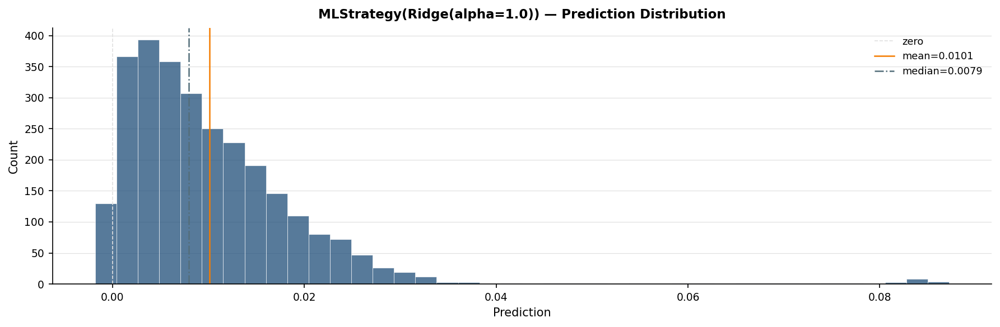

*Distribution of raw model predictions. Near-symmetric distributions centred near zero indicate a well-calibrated model without directional drift or label leakage.*

### Ml Coefficient Evolution

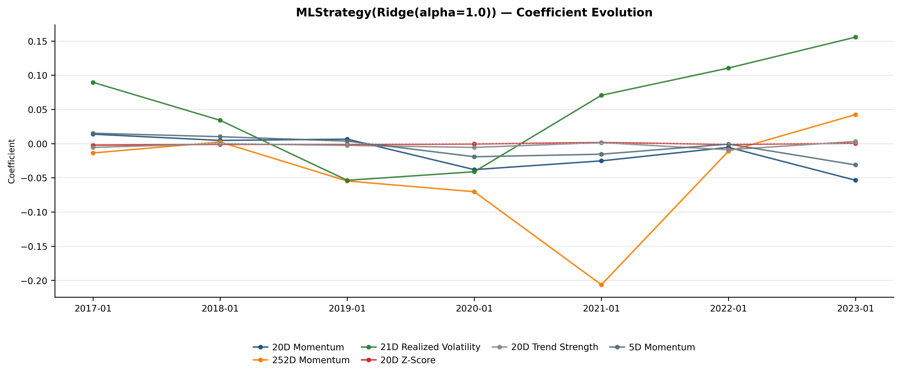

*Coefficient trajectory across walk-forward splits (chronological). Stable features maintain consistent sign and magnitude; unstable features cross zero, indicating regime-dependent learning.*

## Provenance

| Key | Value |
| --- | --- |
| ML hash | `396be8beb2e1` |

---

Report version: 1
Generated: 2026-06-06T14:02:43.131188+00:00
Source experiment: canonical_ml_showcase_v5