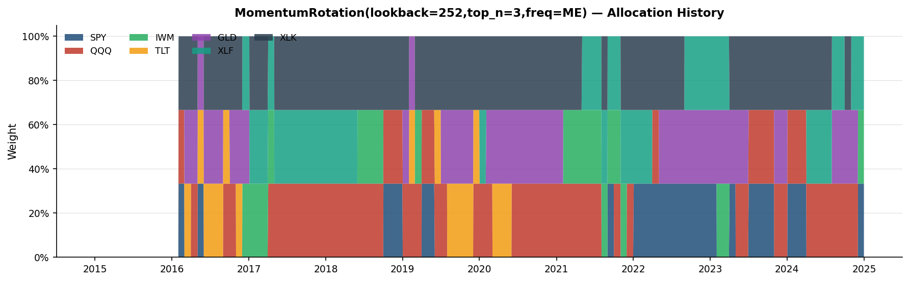
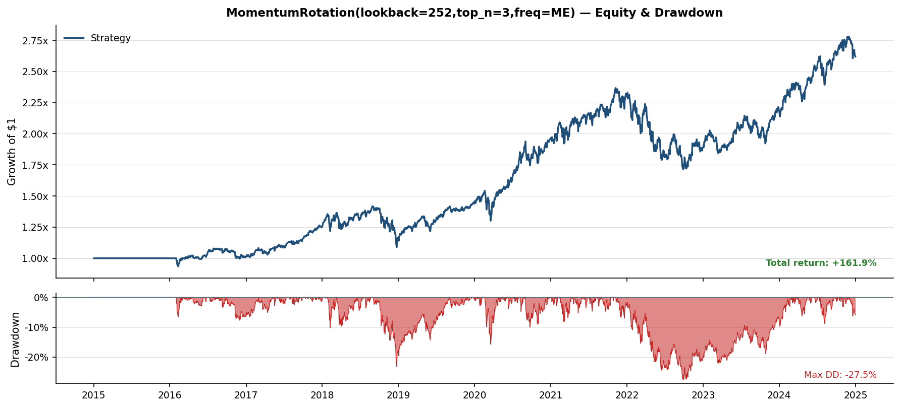
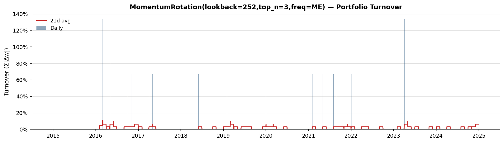
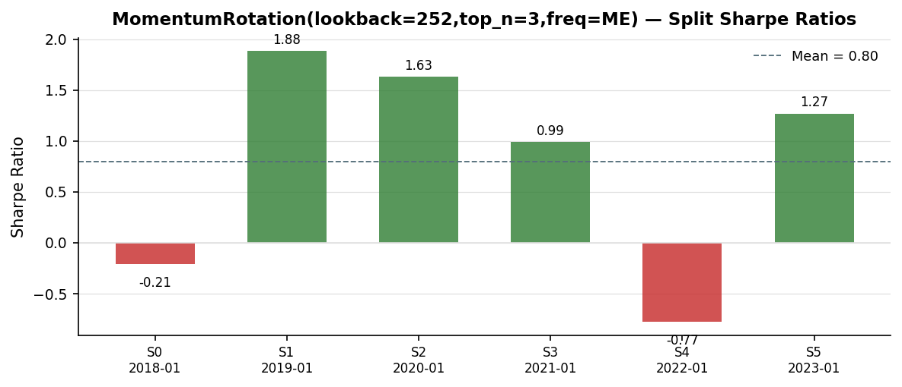
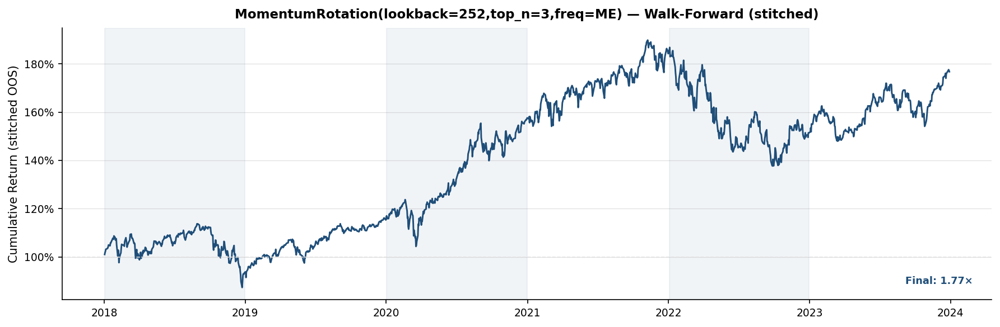

# Experiment Report: example_momentum_rotation

- **Period:** 2015-01-01 to 2024-12-31
- **Universe:** SPY, QQQ, IWM, TLT, GLD, XLF, XLK
- **Sharpe ratio:** 0.7063

## Research Thesis & Methodology

**Hypothesis:** Assets exhibiting strong trailing 12-month price performance will continue to outperform on a risk-adjusted basis over the subsequent 1–3 months, on average and across varied market regimes.

**Economic rationale:** Momentum persistence in cross-sectional asset returns is attributed to three reinforcing mechanisms:

1. *Investor underreaction* — Fundamental information is absorbed slowly into prices. Market participants anchor to prior valuations and revise incrementally, creating predictable near-term drift in the direction of the most recent fundamental change.
2. *Institutional herding* — Risk-budgeting constraints, tracking-error mandates, and performance-chasing capital flows amplify and extend trends beyond what fundamentals alone justify.
3. *Regime persistence* — Macroeconomic regimes (growth, inflation, risk-off) tend to persist for multiple months, sustaining consistent leadership across equity sectors and cross-asset categories.

**Signal construction:** Trailing 252-day total return serves as the momentum signal. The 12-month window is long enough to capture genuine trend persistence while short enough to avoid overlap with the value horizon (24–36 months) at which return reversal dominates. Assets are ranked cross-sectionally each rebalance period; the top 3 of 7 by momentum score are selected and equal-weighted.

**Rebalance policy:** Month-End rebalancing balances two competing objectives: capturing regime persistence across several weeks without accumulating excessive transaction-cost drag. Higher-frequency rebalancing would capture incremental alpha but inflate costs; lower-frequency rebalancing would miss month-to-month leadership transitions.

**Key risks and limitations:**

- *Momentum crashes* — The strategy is acutely exposed to rapid reversals following market dislocations. In crisis-recovery environments (e.g., 2009, 2020), lagging assets frequently outperform leaders by 20–40% within weeks. A long-only momentum strategy has no mechanism to position defensively ahead of such reversals.
- *Regime dependence* — Momentum outperforms in trending, low-volatility environments and underperforms in mean-reverting, high-volatility regimes. Strategy viability in live trading depends partly on the frequency of favourable regimes in the deployment period.
- *Concentration risk* — Holding 3 of 7 assets implies concentrated sector and factor exposure. Adverse selection within the top-N cohort compounds drawdowns during sector-specific dislocations.
- *Look-back sensitivity* — Performance is sensitive to the choice of momentum window. Robustness across alternative windows (e.g., half and double the current lookback) is a necessary validation step not captured by a single-parameter backtest.
- *Transaction costs* — At 5 bps one-way, cost drag compounds materially. Real-world friction for institutional scale or less-liquid instruments may exceed this assumption.

**Scope of this analysis:** This strategy is not presented as a definitive source of live alpha. It is a vehicle for demonstrating a complete, institutionally-rigorous research process: data infrastructure, signal engineering, look-ahead prevention, walk-forward validation, and failure mode analysis. *The methodology is the product.*

## Data Infrastructure

**Data source:** Yahoo Finance daily OHLCV data, ingested via `yfinance` and persisted to local Parquet files for reproducibility. All prices are adjusted closing prices.

**Alignment policy:** Inner join across all universe constituents — only trading days on which every asset has a valid price are retained. This eliminates NaN-driven look-ahead in cross-sectional ranking.

**Missing value policy:** Forward-fill up to a configurable limit (default: 5 trading days) for isolated gaps caused by exchange holidays or data vendor gaps. Gaps exceeding the limit remain NaN and are surfaced in diagnostics rather than silently filled. Over-cleaning (excessive interpolation) introduces bias by smoothing market structure.

**Coverage:** 2516 trading days from 2015-01-02 to 2024-12-31 across 7 assets.

| Asset | NaN Count | Ann. Return | Ann. Volatility |
| --- | --- | --- | --- |
| SPY | 0 | 12.1% | 17.7% |
| QQQ | 0 | 18.5% | 21.8% |
| IWM | 0 | 8.8% | 22.5% |
| TLT | 0 | -2.6% | 15.3% |
| GLD | 0 | 8.5% | 14.1% |
| XLF | 0 | 11.3% | 22.3% |
| XLK | 0 | 20.1% | 23.3% |

## Backtesting Methodology

All backtests use a strictly vectorized, look-ahead-safe execution framework. The critical invariant: no information from period *t* enters the position that earns the return of period *t*.

**Timing convention:**

| Step | Action | When |
| --- | --- | --- |
| Signal computed | Momentum scores calculated from all prices ≤ day *t* | Close of day *t* |
| Position entered | Computed weights applied to portfolio | Open of day *t+1* |
| Return realized | Portfolio return earned | Close of day *t+1* |

**Implementation:** `applied_weights = weights.shift(1)`. The strategy never observes the return it will receive when deciding to trade. The first row of every backtest has a zero position — the portfolio is flat until the first valid signal propagates through the one-day lag.
 Positions are flat for the first 252 trading days during momentum warm-up (insufficient price history for ranking).

**Portfolio return computation per period:**

```
gross_return_t  = sum_i( weight_{i,t-1} * asset_return_{i,t} )
transaction_cost_t = sum_i( |weight_{i,t} - weight_{i,t-1}| ) * (5 / 10_000)
net_return_t    = gross_return_t - transaction_cost_t
equity_curve_t  = product_{s<=t}( 1 + net_return_s ),  anchored at 1.0
drawdown_t      = ( equity_t - max_{s<=t} equity_s ) / max_{s<=t} equity_s
```

**Transaction cost model:** One-way costs of 5 bps are applied to each unit of absolute portfolio weight change. Cost is incurred only on actual weight changes — during forward-fill periods between rebalances, weights are unchanged and no cost is deducted.

**Turnover definition:** Daily turnover = sum of absolute weight changes across all assets per period. Monthly average turnover of X% indicates X% of portfolio value was rotated per rebalance event (one-way).

## Portfolio Construction Process

**Signal-to-portfolio pipeline:**

```
prices[t-lookback : t]
  → trailing_return_i = price[t] / price[t-lookback] - 1   (per asset)
  → cross_sectional_rank_i  (higher momentum = higher rank)
  → top_3_mask  (boolean selection)
  → equal_weight = 1/3 per selected asset
  → forward_fill to daily index
  → shift(1)  [look-ahead prevention]
  → portfolio_weights applied in backtest engine
```

**Rebalance frequency:** month-end. **Selection size:** top 3 by trailing 252-day return.

**Rebalance history:** 48 rebalance events over the backtest period.

**Recent rebalances (most recent last):**

| Date | Holdings | Entered | Exited |
| --- | --- | --- | --- |
| 2023-07-03 | QQQ, SPY, XLK | SPY | GLD |
| 2023-11-01 | GLD, QQQ, XLK | GLD | SPY |
| 2024-01-03 | QQQ, SPY, XLK | SPY | GLD |
| 2024-04-02 | QQQ, XLF, XLK | XLF | SPY |
| 2024-08-01 | GLD, QQQ, XLF | GLD | XLK |
| 2024-10-01 | GLD, QQQ, XLK | XLK | XLF |
| 2024-11-01 | GLD, QQQ, XLF | XLF | XLK |
| 2024-12-03 | IWM, SPY, XLF | IWM, SPY | GLD, QQQ |

*Date shown is the position-entry date (signal computed one trading day prior per the shift(1) convention).*

## Performance Metrics

| Metric | Value |
| --- | --- |
| Annualized Return | 0.1013 |
| Annualized Volatility | 0.1532 |
| Sharpe Ratio | 0.7063 |
| Max Drawdown | -0.2748 |
| Calmar Ratio | 0.3685 |
| Hit Rate | 0.4921 |

## Walk-Forward Validation

**Why chronological walk-forward validation?**

Financial time series are non-stationary. Random k-fold cross-validation — standard in i.i.d. machine learning — introduces look-ahead bias when applied to sequential data: a test fold drawn from 2018 can "learn from" training data from 2020 if folds are randomly assigned. This fundamentally overstates out-of-sample performance.

Chronological rolling validation ensures the model is always tested on data it has never seen in forward time — the only valid simulation of live deployment. Each test window immediately follows its training window, with no overlap and no data from the future entering the training set.

**Validation type:** `rolling`

| Parameter | Value |
| --- | --- |
| gap_days | 0 |
| step_months | 12 |
| test_months | 12 |
| train_months | 36 |

**Split timeline:**

| Split | Train Start | Train End | Test Start | Test End | OOS Sharpe | OOS Return | OOS Max DD |
| --- | --- | --- | --- | --- | --- | --- | --- |
| 0 | 2015-01-02 | 2017-12-29 | 2018-01-02 | 2018-12-31 | -0.21 | -6.4% | -23.2% |
| 1 | 2016-01-04 | 2018-12-31 | 2019-01-02 | 2019-12-31 | 1.88 | 23.1% | -9.2% |
| 2 | 2017-01-03 | 2019-12-31 | 2020-01-02 | 2020-12-31 | 1.63 | 36.5% | -15.7% |
| 3 | 2018-01-02 | 2020-12-31 | 2021-01-04 | 2021-12-31 | 0.99 | 16.9% | -8.2% |
| 4 | 2019-01-02 | 2021-12-31 | 2022-01-03 | 2022-12-30 | -0.77 | -17.9% | -26.3% |
| 5 | 2020-01-02 | 2022-12-30 | 2023-01-03 | 2023-12-29 | 1.27 | 16.9% | -10.4% |

Out-of-sample equity curves are in the Figures section. Per-split stability metrics are in the Diagnostics section.

## Failure Analysis

**Known failure modes for momentum rotation strategies:**

- *Momentum crashes* — The most acute risk. When crowded momentum positions unwind simultaneously (e.g., following a flight-to-quality shock), the strategy holds recent winners that become the hardest-hit assets. The 2009 recovery and COVID snap-back (March–August 2020) are canonical examples.
- *Bond/equity regime transitions* — In risk-off episodes, defensive assets (TLT, GLD) often lead. The strategy may hold these correctly, but the transition itself can cause a drawdown before the new leaders establish their momentum signal.
- *Turnover spikes at regime shifts* — Rapid leadership rotation increases turnover and transaction-cost drag precisely when alpha is weakest. Cost erosion compounds the drawdown.
- *Non-stationarity* — The momentum premium is not constant over time. Periods of elevated market volatility, compressed return dispersion, or mean-reverting micro-structure can cause the signal to be uninformative or counter-productive.

**Identified drawdown windows (> 5% peak-to-trough):**

| Drawdown Start | Trough | Recovery | Max DD | Duration |
| --- | --- | --- | --- | --- |
| 2022-02-10 | 2022-09-27 | 2024-01-19 | -27.5% | 708d |
| 2018-10-10 | 2018-12-24 | 2019-07-24 | -23.2% | 287d |
| 2020-03-09 | 2020-03-18 | 2020-04-06 | -15.7% | 28d |

**Worst out-of-sample split:**

- Split 4 — test period 2022-01-03 to 2022-12-30
- Sharpe: -0.77
- Return: -17.9%
- Max DD: -26.3%

**Overall risk assessment:**

- Full-period max drawdown of -27.5% represents a moderate peak-to-trough loss. Investors must be positioned to hold through such episodes without forced liquidation.
- Full-period Sharpe of 0.71 represents adequate risk-adjusted performance. Walk-forward validation assesses whether this is structural or the result of in-sample fitting.

## Diagnostics Appendix

This appendix presents detailed diagnostic tables for in-depth analysis. The Walk-Forward Stability table surfaces per-split performance variance; consistent Sharpe ratios across splits indicate a regime-independent signal, while high variance suggests the strategy is sensitive to specific market conditions encountered in individual periods.

### Walk-Forward Stability

| Metric | Value |
| --- | --- |
| Splits | 6 |
| Mean Sharpe | 0.7988 |
| Std Sharpe | 1.0596 |
| Positive-Sharpe rate | 66.7% |
| Mean annualised return | 11.53% |
| Mean max drawdown | -15.48% |
| Worst max drawdown | -26.31% |

**Per-split results:**

| Split | Test Start | Test End | Sharpe | Return | Max DD |
| --- | --- | --- | --- | --- | --- |
| 0 | 2018-01-02 | 2018-12-31 | -0.2066 | -6.39% | -23.21% |
| 1 | 2019-01-02 | 2019-12-31 | 1.8833 | 23.15% | -9.16% |
| 2 | 2020-01-02 | 2020-12-31 | 1.6324 | 36.54% | -15.68% |
| 3 | 2021-01-04 | 2021-12-31 | 0.9891 | 16.88% | -8.16% |
| 4 | 2022-01-03 | 2022-12-30 | -0.7743 | -17.89% | -26.31% |
| 5 | 2023-01-03 | 2023-12-29 | 1.2691 | 16.90% | -10.38% |

## Metadata

| Field | Value |
| --- | --- |
| Experiment | `example_momentum_rotation` |
| Strategy | `MomentumRotation(lookback=252,top_n=3,freq=ME)` |
| Created | 2026-05-24T14:32:50.919049+00:00 |

## Configuration

**Universe:** SPY, QQQ, IWM, TLT, GLD, XLF, XLK

**Date range:** 2015-01-01 to 2024-12-31

**Strategy type:** `MomentumRotation`

| Parameter | Value |
| --- | --- |
| lookback | 252 |
| rebalance_freq | ME |
| top_n | 3 |

**Transaction cost:** 5.0 bps
**Validation:** `rolling`

## Figures

### Allocation History



### Equity And Drawdown



### Portfolio Turnover



### Split Sharpes



### Walk Forward Stitched



---

Report version: 1
Generated: 2026-05-25T12:40:31.741756+00:00
Source experiment: example_momentum_rotation